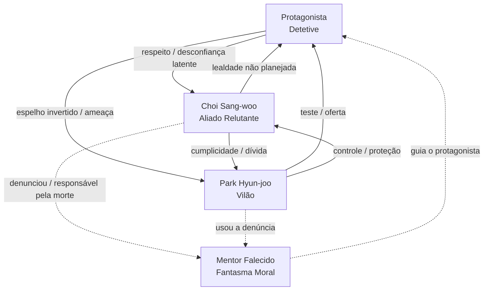

# 📖 GUIA DE DESENVOLVIMENTO DE PERSONAGENS
### Referência Completa para Livros · Filmes · Séries · Dramas · Mangás · Animações

> *"Um personagem memorável não é aquele que não tem falhas — é aquele cujas falhas importam tanto quanto suas virtudes."*
> — David Corbett, *The Art of Character*

---

## ÍNDICE

- [[#SEÇÃO 1 — DESENVOLVIMENTO DE PERSONAGEM]]
- [[#SEÇÃO 2 — CRIAÇÃO DE MICRO-LORES]]
- [[#SEÇÃO 3 — NPCs E PERSONAGENS SECUNDÁRIOS]]
- [[#SEÇÃO 4 — CRIAÇÃO DE ALIADOS]]
- [[#SEÇÃO 5 — CRIAÇÃO DE VILÕES]]
- [[#SEÇÃO 6 — TEIA DE RELACIONAMENTOS]]

---

# SEÇÃO 1 — DESENVOLVIMENTO DE PERSONAGEM

> [!abstract] Por que isso importa
> Personagens cativantes são a espinha dorsal de qualquer narrativa. Antes de qualquer trama, eles precisam existir como seres plausíveis — com desejos, medos, contradições e histórias que fazem sentido *sem* o enredo. Se o personagem só existe por causa da trama, ele é uma marionete. Se a trama existe por causa do personagem, ele é vivo.

---

## BLOCO 1 — IDENTIDADE VISUAL

**Use este bloco para todo personagem criado, principal ou secundário.**

```
[Nome]=
[Gênero]=
[Nacionalidade / Origem Cultural]=
[Tipo de corpo]= (magro / atlético / robusto / corpulento / frágil / musculoso / andrógino)
[Descrição Corporal]= (altura aproximada, postura, marcas, cicatrizes, tatuagens)
[Cor dos olhos]=
[Cor do cabelo]=
[Descrição do cabelo]= (comprimento, textura, corte, forma como cai)
[Expressão predominante]= (o que o rosto transmite em repouso)
[Pose característica]= (como ele fica parado, em pé, sentado)
[Arma ou objeto característico]=
[Tamanho do busto, se mulher]= (P / muito pequeno / médio / grande / muito grande)
[Estilo de roupa]= (prático / elegante / descuidado / simbólico / uniforme)
[Detalhe visual único]= (o que o torna imediatamente reconhecível)
```

> [!example] BLOCO 1 preenchido — Exemplo: Personagem de Drama Histórico
> ```
> [Nome]= Seo Ji-an
> [Gênero]= Feminino
> [Nacionalidade / Origem Cultural]= Coreana, Joseon tardio
> [Tipo de corpo]= Delicado, mas com postura treinada
> [Descrição Corporal]= 1,62m, ombros ligeiramente curvados por anos de deferência
>                       forçada; mãos com calosidades de quem costura
> [Cor dos olhos]= Castanho escuro, quase preto
> [Cor do cabelo]= Preto
> [Descrição do cabelo]= Liso, preso em gejeoksam tradicional; mechas escapam
>                        nas laterais quando está agitada
> [Expressão predominante]= Reservada, olhos que calculam antes de falar
> [Pose característica]= Mãos entrelaçadas na frente do corpo; nunca gesticula
>                        sem razão
> [Arma ou objeto característico]= Agulha de bordado com cabo de osso — herdada
>                                   da mãe, carregada escondida na manga
> [Tamanho do busto, se mulher]= Pequeno
> [Estilo de roupa]= Hanbok simples, cores apagadas; evita chamar atenção
> [Detalhe visual único]= Uma cicatriz fina na linha da mandíbula esquerda —
>                         resultado de uma bofetada com anel aos 14 anos
> ```

---

## BLOCO 2 — IDENTIDADE NARRATIVA (6 Camadas)

A identidade narrativa responde à pergunta: **Quem é este ser, além da aparência?**

Cada camada é interdependente. A motivação nasce do trauma. O conflito interno nasce da tensão entre motivação e identidade. Os relacionamentos-âncora revelam todas as outras camadas.

---

### As 6 Camadas

**① IDENTIDADE** — Quem é agora?
O estado atual do personagem: o que ele faz, onde está, como os outros o percebem. Não é o que ele *quer* ser — é o que ele *é* no início da história.

**② ORIGEM** — De onde veio?
Lugar, família, classe social, cultura. A origem não é só geográfica — é a moldura de valores que foi instalada nele antes de ter consciência crítica.

**③ TRAUMA OU EVENTO-CHAVE** — O que o moldou?
O momento que partiu o personagem em um "antes" e um "depois". Não precisa ser violência — pode ser uma ausência, uma escolha errada, uma traição sofrida ou praticada.

**④ MOTIVAÇÃO CONCRETA** — O que ele quer?
*Nunca "justiça" ou "paz".* Sempre uma coisa específica:
- *"Vencer o torneio que matou meu irmão"*
- *"Fazer minha mãe me ver como digna"*
- *"Provar que o sistema pode ser mudado de dentro"*

**⑤ CONFLITO INTERNO** — O que o impede?
A contradição entre o que ele quer e o que ele é. É a fonte do drama real. Tyrion Lannister quer ser respeitado, mas acredita, no fundo, que não merece — então age de formas que confirmam o desrespeito.

**⑥ RELACIONAMENTOS-ÂNCORA** — Quem define quem ele é?
Os 3–5 personagens que revelam facetas opostas do protagonista. Um aliado que vê o melhor nele. Um rival que vê o pior. Um amor que vê a verdade.

---

### TEMPLATE DE BACKGROUND RÁPIDO (6 linhas)

*Use para personagens secundários ou como rascunho inicial de protagonistas.*

```
IDENTIDADE:    [O que é / onde está agora — 1 frase]
ORIGEM:        [De onde veio — 1 frase com detalhe concreto]
TRAUMA:        [O evento que o definiu — 1 frase específica]
MOTIVAÇÃO:     [O que quer concretamente — 1 frase sem abstrações]
CONFLITO:      [O que o impede internamente — 1 frase]
ÂNCORAS:       [Nome(s) + tipo de relação — máx. 2 por linha]
```

> [!example] Background Rápido — Exemplo Preenchido
> ```
> IDENTIDADE:    Detetive da polícia de Seoul, conhecido por resolver casos
>                que outros descartam — e por nunca comparecer a celebrações.
> ORIGEM:        Criado em Busan por uma mãe solteira que limpava escritórios à
>                noite; aprendeu a ser invisível antes de aprender a ler.
> TRAUMA:        Seu primeiro parceiro foi morto em uma emboscada que ele poderia
>                ter evitado se tivesse agido em vez de esperado ordens.
> MOTIVAÇÃO:     Fechar o caso que sua ex-parceira deixou aberto quando morreu —
>                e que envolve o filho do prefeito.
> CONFLITO:      Acredita que as regras existem para proteger os fracos, mas só
>                consegue resultados quando as quebra.
> ÂNCORAS:       Kim Soo-yeon (mentora falecida — fantasma moral) /
>                Park Jae-in (suspeita-chave — atração perigosa)
> ```

---

### TEMPLATE DE BACKGROUND LONGO (Personagens Principais)

*Use quando o personagem sustenta arcos de múltiplos atos.*

```
━━━━━━━━━━━━━━━━━━━━━━━━━━━━━━━━━━━━━
FICHA NARRATIVA COMPLETA
━━━━━━━━━━━━━━━━━━━━━━━━━━━━━━━━━━━━━

NOME:
PAPEL NA HISTÓRIA: (protagonista / deuteragonista / antagonista / secundário)

── IDENTIDADE ──
Estado atual:
Como o mundo o percebe:
Como ele se percebe:
Diferença entre as duas percepções:

── ORIGEM ──
Lugar de origem:
Família / Estrutura social:
Valores instalados na infância:
O que ele jurou nunca ser (mas talvez esteja se tornando):

── TRAUMA / EVENTO-CHAVE ──
O evento:
Quem estava envolvido:
O que ele perdeu:
O que ele ganhou sem perceber:
Como ele conta essa história para si mesmo (a versão distorcida):

── MOTIVAÇÃO ──
O que ele quer na superfície:
O que ele realmente quer (motivação profunda):
O que ele teme precisar para conseguir:
O preço que ele ainda não está disposto a pagar:

── CONFLITO INTERNO ──
A contradição central:
O momento em que isso vai explodir:
Qual escolha impossível ele vai ter de fazer:

── ARCO ──
Onde começa:
Onde termina:
O que muda:
O que permanece (porque nem tudo precisa mudar):

── RELACIONAMENTOS-ÂNCORA ──
[Nome] — [Tipo] — [Função narrativa] — [Tensão latente]
[Nome] — [Tipo] — [Função narrativa] — [Tensão latente]
[Nome] — [Tipo] — [Função narrativa] — [Tensão latente]

── VOZ ──
Como ele fala (vocabulário, ritmo, evasões):
O que ele nunca diz diretamente:
Frase que só ele diria:
━━━━━━━━━━━━━━━━━━━━━━━━━━━━━━━━━━━━━
```

---

### CHECKLIST — "Meu personagem está conectado ao mundo?"

Responda SIM ou NÃO para cada pergunta. Três ou mais NÃOs indicam que o personagem ainda está flutuando no vácuo narrativo.

- [ ] **1.** Ele tem uma opinião específica sobre algo que aconteceu antes da história começar?
- [ ] **2.** Alguém no mundo o conhece e tem uma expectativa sobre ele — que pode estar certa ou errada?
- [ ] **3.** Ele quer algo que o mundo pode dar *ou* negar, independente da trama principal?
- [ ] **4.** Seu passado deixou marcas visíveis no presente — hábitos, medos, cicatrizes, vocabulário?
- [ ] **5.** Se a trama principal fosse removida, ele ainda teria um problema para resolver?

---

### Exemplos Reais de Personagens Bem Construídos

| Personagem | Obra | Por que funciona |
|---|---|---|
| **Frodo Bolseiro** | *O Senhor dos Anéis* — Tolkien | Motivação concreta (destruir o Anel) + conflito interno (o Anel o corrompe) + trauma (a missão que ninguém pediu para ele) |
| **Tyrion Lannister** | *Game of Thrones* — G.R.R. Martin | Identidade vs. percepção externa radicalmente diferentes; motivação de ser amado conflita com comportamento autodestrutivo |
| **Edward Elric** | *Fullmetal Alchemist* — Arakawa | Trauma específico (traição da lei da equivalência) + motivação concreta (restaurar o corpo do irmão) + conflito interno (orgulho que o impede de pedir ajuda) |
| **Percy Jackson** | *Percy Jackson* — Rick Riordan | Origem desvantajosa (dislexia, TDAH) ressignificada como força; relacionamentos-âncora com Annabeth e Grover definem suas decisões |
| **Jinx / Powder** | *Arcane* — Riot Games | Trauma de infância (acidente que mata os amigos da irmã) + conflito entre quem ela era e quem o mundo a forçou a ser + arco de queda trágico sem vilania gratuita |

---

# SEÇÃO 2 — CRIAÇÃO DE MICRO-LORES

> [!abstract] O que é Micro-Lore
> Lore não é o manual do mundo — é o **sangue que circula por baixo da pele**. Micro-lore são fragmentos de história, cultura, crença e memória que existem *antes* da trama começar e que os personagens carregam sem precisar explicar. Quando Geralt de Rívia faz uma careta ao ouvir um nome, isso é micro-lore funcionando. Quando Edward Elric recusa-se a usar armas de metal em alguém que não pode se defender, isso é micro-lore incorporado.

---

## Técnica 1 — Bottom-Up (De Baixo para Cima)

A maioria dos worldbuilders comete o erro de começar pelo macro: mapas, impérios, cosmogonias. O micro-lore começa pelo oposto.

**Passo a passo:**

1. Escolha **1 objeto, lugar ou evento concreto** (uma espada, uma ponte, uma noite específica)
2. Responda: *Por que esse objeto/lugar existe?*
3. Responda: *Quem foi afetado por ele e como?*
4. Responda: *O que alguém que não estava lá pensa que aconteceu?*
5. Deixe a resposta à última pergunta contaminar a cultura

> [!example] Bottom-Up em Ação
> **O objeto:** Uma ponte de pedra coberta de nomes gravados
> **Por que existe?** Construída após uma guerra civil para conectar dois lados da cidade que se recusavam a se ver
> **Quem foi afetado?** Os familiares dos mortos gravaram os nomes como forma de luto; a cidade proibiu e depois desistiu de proibir
> **Versão distorcida:** A nova geração acredita que a ponte foi construída *pela* guerra, não *apesar* dela — e a venera como monumento à resistência
> **Contaminação cultural:** Jovens da cidade gravam nomes de pessoas vivas que amam, como promessa. Personagens que não fazem isso são vistos como frios.

---

## Técnica 2 — O Método das VERDADES

Frases curtas, afirmativas, que definem fatos imutáveis do mundo. Não são regras de magia — são axiomas culturais.

**Formato:** *"Neste mundo, é verdade que ___."*

**Regras:**
- Máximo de 10 Verdades por mundo (mais que isso é exposição)
- Cada Verdade deve criar pelo menos 1 consequência social
- Pelo menos 1 Verdade deve ser algo que os personagens *não questionam* mas o leitor vai questionar

> [!example] Método das Verdades — Exemplo
> **Mundo:** Cidade-estado marítima pós-colapso climático
>
> 1. *"A água doce é moeda."* → Consequência: Os ricos cheiram diferente. Banhar-se é ostentação.
> 2. *"Ninguém nasce com nome — o nome é dado quando você faz algo que merece ser lembrado."* → Consequência: Crianças são chamadas de "o pequeno" até a adolescência. Morrer sem nome é a maior desonra.
> 3. *"Os Navegantes não mentem — apenas escolhem o que contar."* → Consequência: Toda mentira é chamada de "navegar a verdade". Ninguém confia em quem diz "eu juro".

---

## Técnica 3 — Lore que Nasce do Background dos Personagens

O método mais orgânico: o passado do personagem *é* o micro-lore.

**Como funciona:**
1. Escreva o background do personagem (usando BLOCO 2)
2. Identifique cada referência cultural, histórica ou geográfica que aparece
3. Para cada referência, escreva 2 frases de contexto
4. Essas 2 frases se tornam micro-lore que outros personagens também conhecem

> [!tip] Referências Reais que Usam Isso Bem
> - **The Witcher (Sapkowski):** O preconceito contra bruxos não é explicado em capítulos de worldbuilding — é vivido por Geralt em cada taverna, cada contrato recusado, cada criança que chora ao vê-lo. O lore nasce das cicatrizes do protagonista.
> - **Fullmetal Alchemist (Arakawa):** A Lei da Equivalência não é explicada no capítulo 1 — é *sentida* através do trauma dos irmãos Elric. O leitor aprende a lei ao ver o que acontece quando ela é violada.
> - **Attack on Titan (Isayama):** A história real dos Eldianos não é revelada imediatamente — é reconstituída através dos preconceitos que os personagens carregam, contradições em canções infantis e silêncios em livros de história.

---

## TEMPLATE DE MICRO-LORE

```
━━━━━━━━━━━━━━━━━━━━━━━━━━━━━━━━━━━━━
FICHA DE MICRO-LORE
━━━━━━━━━━━━━━━━━━━━━━━━━━━━━━━━━━━━━
NOME:           [O nome pelo qual é conhecido no mundo]
TIPO:           (lugar / objeto / evento / crença / pessoa histórica / lei cultural)
ORIGEM:         [O que realmente aconteceu — a versão histórica]
VERSÃO POPULAR: [O que a maioria das pessoas acredita]
IMPACTO ATUAL:  [Como isso afeta o mundo *hoje*, na história]
GANCHO:         [A pergunta que esse lore levanta sem responder]
PERSONAGEM      [Quem carrega esse lore de forma mais visível]
CONECTADO:
━━━━━━━━━━━━━━━━━━━━━━━━━━━━━━━━━━━━━
```

---

### 3 Exemplos de Micro-Lore Completos

> [!example] Micro-Lore #1 — O Tratado de Cinzas
> ```
> NOME:           O Tratado de Cinzas
> TIPO:           Evento histórico
> ORIGEM:         Acordo de rendição assinado após uma guerra de 40 anos;
>                 o general vencedor queimou os documentos originais
>                 para que nenhum lado pudesse alegar vantagem futura
> VERSÃO POPULAR: A guerra terminou porque ambos os lados perceberam que
>                 lutavam pelo mesmo deus, que os abandonou a ambos
> IMPACTO ATUAL:  Qualquer acordo político sério é selado queimando papel
>                 em conjunto — ritual que ninguém sabe de onde veio
> GANCHO:         Por que o general queimou os documentos? O que ele escondia?
> PERSONAGEM      O antagonista, cujo avô foi o general vencedor
> CONECTADO:
> ```

> [!example] Micro-Lore #2 — O Vazio da Sétima Lua
> ```
> NOME:           O Vazio da Sétima Lua
> TIPO:           Crença / Evento cíclico
> ORIGEM:         Uma noite a cada sete anos em que os registros históricos
>                 simplesmente param — como se ninguém tivesse escrito nada
> VERSÃO POPULAR: Os deuses "respiram" nessa noite e mortais que testemunham
>                 esse momento ficam temporariamente cegos para o sagrado
> IMPACTO ATUAL:  Casamentos, execuções e nascimentos nessa noite são
>                 considerados nulos por lei; a protagonista nasceu nessa noite
> GANCHO:         O que realmente acontece nessa noite que as pessoas
>                 preferem não lembrar?
> PERSONAGEM      A protagonista, que não tem registros de nascimento e
> CONECTADO:      é tecnicamente "invisível" para o estado
> ```

> [!example] Micro-Lore #3 — A Última Linha da Guarda
> ```
> NOME:           A Última Linha da Guarda
> TIPO:           Objeto + crença
> ORIGEM:         Uma muralha incompleta construída por escravos que nunca
>                 foram libertados; a construção parou quando o rei morreu
>                 sem herdeiro
> VERSÃO POPULAR: A muralha "escolhe" quem pode atravessá-la — aqueles com
>                 sangue culpado são barrados por forças invisíveis
> IMPACTO ATUAL:  A nobreza evita atravessar a muralha publicamente; quem
>                 atravessa é visto como inocente ou sem honra a perder
> GANCHO:         O protagonista, cuja família construiu a muralha, nunca
>                 conseguiu atravessá-la
> PERSONAGEM      O protagonista e o seu aliado relutante (que atravessa
> CONECTADO:      sem esforço e não entende por quê isso perturba todos)
> ```

---

# SEÇÃO 3 — NPCs E PERSONAGENS SECUNDÁRIOS

> [!abstract] A Regra de Ouro
> Todo personagem secundário é o protagonista da *própria* história. Ele não existe para servir ao protagonista — ele coexiste no mesmo mundo e, por acidente ou destino, seus caminhos se cruzam. Quando um secundário parece que *só existe* para ajudar o herói, o leitor sente. E para de acreditar.

---

## Template de Personagem Secundário Funcional (3 linhas)

*Para personagens que aparecem 1–3 vezes e precisam ser memoráveis sem profundidade total.*

```
NOME:       [Nome]
TREJEITO:   [1 hábito físico, verbal ou comportamental único e específico]
QUER:       [O que está tentando conseguir nesta cena]
TEME:       [O que evita a qualquer custo]
```

> [!example] Secundários Funcionais — 3 Exemplos
> ```
> NOME:       Velho Hwan
> TREJEITO:   Sempre ajusta o mesmo botão inexistente no casaco — hábito de
>             quando era policial e precisava checar o distintivo
> QUER:       Vender informação sem parecer que está vendendo informação
> TEME:       Que a pessoa que ele está ajudando sobreviva para contar quem ajudou
>
> ───
>
> NOME:       Dra. Yoon Mi-rae
> TREJEITO:   Faz diagnósticos olhando as mãos das pessoas antes dos olhos
> QUER:       Que alguém, uma vez, siga suas instruções sem questionar
> TEME:       Que seu filho descubra o que ela fez para pagar pela faculdade dele
>
> ───
>
> NOME:       O Arqueiro do Posto Norte
> TREJEITO:   Ri antes de dizer qualquer coisa séria
> QUER:       Ser transferido para a capital antes do inverno
> TEME:       Que a transferência chegue tarde demais
> ```

---

## Template de Personagem Secundário Memorável (Completo)

*Para personagens recorrentes que têm arco próprio.*

```
━━━━━━━━━━━━━━━━━━━━━━━━━━━━━━━━━━━━━
[BLOCO 1 — IDENTIDADE VISUAL]
(preencher conforme template da Seção 1)

━━━━━━━━━━━━━━━━━━━━━━━━━━━━━━━━━━━━━
[IDENTIDADE NARRATIVA RESUMIDA]

MOTIVAÇÃO:          [O que quer concretamente]
SEGREDO:            [O que esconde — e de quem]
RELAÇÃO C/ PROT.:   [Como conheceu / por que importa / qual é a tensão]
COMO EVOLUI:        [Onde começa vs. onde termina]
FUNÇÃO NARRATIVA:   (espelho / catalisador / contraponto / âncora moral / informante)
━━━━━━━━━━━━━━━━━━━━━━━━━━━━━━━━━━━━━
```

---

## Como Criar Continuidade e Fazer o Leitor se Importar

**3 técnicas comprovadas:**

**① O Problema Paralelo** — O secundário tem um problema que espelha o do protagonista, mas que não será resolvido da mesma forma. Enquanto o herói supera o trauma, o secundário cede a ele. O contraste faz ambos brilharem.

**② A Cena Sem o Protagonista** — Mostre o secundário fazendo algo quando o protagonista não está por perto. Isso prova que ele existe fora da função narrativa.

**③ O Detalhe que Fica** — Um objeto, frase ou hábito do secundário que reaparece depois que ele foi embora. Samwise Gamgee planta uma árvore no fim de *O Senhor dos Anéis* — e o leitor entende que aquele ato define tudo que Sam é.

---

## Exemplos Reais de Secundários Icônicos

| Personagem | Obra | O que o torna memorável |
|---|---|---|
| **Samwise Gamgee** | *O Senhor dos Anéis* | Arco próprio (medo de aventura → coragem além dos limites) + função de espelho moral de Frodo. Tolkien afirmou que Sam é o verdadeiro herói. |
| **Tyrion Lannister** | *Game of Thrones* | Começou como secundário e tomou a narrativa. Segredo (assassinato do pai), motivação (sobrevivência + ser amado), relação com Jaime — todos os elementos do template completo. |
| **Zuko** | *Avatar: A Lenda de Aang* | Arco de redenção de secundário-antagonista para aliado; a tensão com Iroh (mentor) revela que ele sabe o que é certo mas tem medo de escolher |
| **Killua Zoldyck** | *Hunter × Hunter* | Contraponto de Gon: onde Gon tem fé irrestrita, Killua tem medo. O segredo (condicionamento familiar para matar) emerge lentamente |

---

## Ficha-Coringa para Criação Rápida

*Quando precisar de um secundário em menos de 2 minutos:*

```
1. Escolha 1 profissão incomum para o cenário
2. Dê a ele 1 coisa que ama de forma irracional
3. Dê a ele 1 coisa que odeia por razão pessoal (não abstrata)
4. Decida: ele vai ajudar o protagonista POR INTERESSE ou APESAR DO INTERESSE?
5. Dê 1 frase que só ele diria
```

---

# SEÇÃO 4 — CRIAÇÃO DE ALIADOS

> [!abstract] Aliados como Espelhos
> Um aliado não está na história para facilitar a vida do protagonista — está para *revelar* quem o protagonista é. O que o herói aceita de ajuda diz tanto sobre ele quanto o que ele recusa. Gandalf não pode levar o Anel por Frodo — e essa limitação define o que Frodo precisa se tornar.

---

## Os 5 Tipos de Aliado

### 1. O MENTOR
*"Eu vi o que você pode ser. Você ainda não viu."*

Função: Transmite sabedoria, abre caminhos, representa o que o herói pode se tornar — e frequentemente morre ou falha para forçar o herói a seguir sozinho.

**Regra crítica:** O Mentor precisa ter uma limitação clara. Mentores perfeitos são muletas narrativas. Gandalf cai em Moria. Dumbledore esconde a verdade por anos. Yoda viveu em exílio e carrega culpa.

---

### 2. O PARCEIRO
*"Você vai, eu vou. Simples assim."*

Função: Companheiro de jornada que complementa as fraquezas do protagonista sem ser perfeito. O conflito entre parceiros revela os valores de ambos.

**Regra crítica:** O parceiro deve discordar do protagonista pelo menos uma vez de forma significativa — e estar certo nessa discordância.

---

### 3. O INFORMANTE
*"Eu sei coisas que você precisa saber. Por um preço."*

Função: Ponte entre o protagonista e o mundo do vilão ou do lore. Geralmente moralmente ambíguo — aliado por conveniência, não por lealdade.

**Regra crítica:** O informante nunca deve ser totalmente confiável. Se ele nunca mente, deixa de ser interessante. Se sempre mente, deixa de ser útil.

---

### 4. O PROTETOR
*"Você não vai passar por mim para chegar a ele."*

Função: Escudo físico ou simbólico. Frequentemente tem motivação própria para proteger — que não é necessariamente amor pelo protagonista.

**Regra crítica:** O protetor deve ter algo a perder além do protagonista. Se ele só existe para proteger, sua morte não tem peso narrativo.

---

### 5. O ALIADO RELUTANTE
*"Eu detesto você. Mas detesto eles mais."*

Função: Tensão máxima de relacionamento. Concordam nos objetivos, discordam em tudo mais. A aliança pode quebrar a qualquer momento.

**Regra crítica:** A razão pela qual ele é relutante deve ser justa. O protagonista deve *merecer* a relutância.

---

## Como um Aliado Pode Virar Antagonista

Esta virada funciona quando:

1. **A motivação do aliado sempre esteve lá** — e o leitor, relendo, percebe os sinais
2. **A virada nasce de uma escolha, não de uma revelação** — o aliado não era "secretamente mau"; ele *escolheu* a traição por razões que fazem sentido
3. **O protagonista é parcialmente responsável** — algo que o herói fez ou deixou de fazer empurrou o aliado para o outro lado

> [!warning] Quando NÃO usar essa virada
> Não use se o único propósito for "surpreender". A traição precisa recontextualizar a história — quando o leitor relê, cada cena com o aliado precisa ganhar novo significado.

---

## TEMPLATE DE ALIADO

```
━━━━━━━━━━━━━━━━━━━━━━━━━━━━━━━━━━━━━
[BLOCO 1 — IDENTIDADE VISUAL]
(preencher conforme Seção 1)

━━━━━━━━━━━━━━━━━━━━━━━━━━━━━━━━━━━━━
[IDENTIDADE DO ALIADO]

TIPO DE ALIADO:         (mentor / parceiro / informante / protetor / relutante)
PAPEL NARRATIVO:        [O que sua presença revela sobre o protagonista]
MOTIVAÇÃO P/ AJUDAR:    [Por que escolhe ficar ao lado do herói — seja específico]
LIMITAÇÃO:              [O que ele não pode ou não vai fazer]
PONTO DE TENSÃO:        [O momento onde a aliança vai ser testada]
SEGREDO:                [O que ele esconde do protagonista]
POTENCIAL DE VIRADA:    [Sim / Não — e se sim, sob qual condição]
━━━━━━━━━━━━━━━━━━━━━━━━━━━━━━━━━━━━━
```

---

## Exemplo de Aliado Completo (BLOCO 1 + BLOCO 2)

> [!example] ALIADO COMPLETO — Choi Sang-woo
>
> **BLOCO 1 — IDENTIDADE VISUAL**
> ```
> [Nome]= Choi Sang-woo
> [Gênero]= Masculino
> [Nacionalidade]= Coreano
> [Tipo de corpo]= Esguio, quase magro — parece mais fraco do que é
> [Descrição Corporal]= 1,78m; postura ereta demais, como alguém que foi
>                        ensinado a não ocupar espaço; nenhuma cicatriz visível
> [Cor dos olhos]= Castanho claro
> [Cor do cabelo]= Preto
> [Descrição do cabelo]= Curto, impecavelmente penteado — nunca um fio fora do lugar
> [Expressão predominante]= Cortesia calculada; sorriso que não chega aos olhos
> [Pose característica]= Mãos nos bolsos; raramente gesticula; observa antes de entrar
> [Arma]= Nenhuma (usa palavras e informação como armas)
> [Tamanho do busto]= N/A
> [Estilo de roupa]= Terno discreto; sempre a cor errada para se destacar — azul
>                    quando todos vestem cinza, cinza quando todos vestem azul
> [Detalhe visual único]= Um relógio de pulso sem ponteiros — presente do pai que
>                          ele nunca explica
> ```
>
> **BLOCO 2 — IDENTIDADE NARRATIVA**
> ```
> TIPO DE ALIADO:         Aliado Relutante (com potencial de virada)
>
> PAPEL NARRATIVO:        Espelho invertido do protagonista — onde o herói age por
>                          instinto moral, Sang-woo age por cálculo racional. Revela
>                          que "fazer a coisa certa" tem um custo que o protagonista
>                          ainda não pagou.
>
> MOTIVAÇÃO P/ AJUDAR:    O protagonista sabe algo que pode destruir Sang-woo — e
>                          Sang-woo prefere tê-lo perto do que longe. Mas ao longo
>                          do tempo, desenvolve respeito genuíno que ele nunca
>                          planejou sentir.
>
> LIMITAÇÃO:              Não age se não vê caminho de saída pessoal. Nunca vai se
>                          sacrificar por princípio — apenas por cálculo.
>
> PONTO DE TENSÃO:        Quando o protagonista pedir que ele assuma
>                          responsabilidade pública por algo que fizeram juntos.
>
> SEGREDO:                Ele denunciou o mentor do protagonista anos atrás — e o
>                          mentor morreu por causa disso. Não por maldade: por
>                          sobrevivência.
>
> POTENCIAL DE VIRADA:    Sim — se o protagonista descobrir o segredo antes de
>                          Sang-woo ter a chance de explicar. A virada não seria
>                          para "vilão" — seria para adversário trágico.
> ```

---

# SEÇÃO 5 — CRIAÇÃO DE VILÕES

> [!warning] A Regra Fundamental
> **O vilão deve ter razão — pelo menos para si mesmo.**
>
> Um vilão que não acredita na própria lógica é um obstáculo, não um antagonista. A diferença entre os dois: obstáculos são removidos. Antagonistas transformam o protagonista. Os melhores vilões são aqueles que, em circunstâncias diferentes, poderiam ter sido heróis — ou que *eram* heróis antes de uma escolha irreversível.

---

## Os 4 Tipos de Motivação que Funcionam

### TIPO 1 — PESSOAL / EMOCIONAL
*"Isso aconteceu comigo. Não vou deixar acontecer com ninguém — ou vou fazer acontecer com todos."*

O vilão age a partir de uma ferida real. A empatia do público é possível porque a origem da dor é compreensível; o erro está na resposta escolhida.

**Exemplo:** Magneto (*X-Men*) — sobrevivente do Holocausto que jurou nunca mais deixar sua gente ser caçada. A lógica é compreensível. A solução (dominação mutante) é o erro.

---

### TIPO 2 — IDEOLÓGICA
*"Eu estou certo. A história vai me dar razão. As vítimas são o preço do progresso."*

O vilão genuinamente acredita que representa um bem maior. Não há arrependimento — há convicção. O horror nasce de ver uma mente brilhante aplicada a uma conclusão errada com perfeita coerência interna.

**Exemplo:** Thanos (*MCU*) — viu seu planeta morrer por superpopulação e tirou a conclusão "lógica" de que reduzir a população resolve o problema. Ele não gosta de matar; acha necessário.

**Exemplo:** Eren Yeager (*Attack on Titan*) — começou como herói, chegou à conclusão de que a única forma de proteger seus amigos era eliminar todo o mundo externo. A ideologia cresceu organicamente do trauma e da lógica de um guerreiro que não conhece outra solução.

---

### TIPO 3 — PODER / CONTROLE
*"O caos é o inimigo. Eu sou a ordem. E a ordem tem um custo."*

A motivação mais simples, mas que exige as mais densas camadas. A busca por controle raramente nasce do prazer pelo poder — nasce do medo de ser controlado, de ter sido impotente, de ter visto o caos destruir algo amado.

**Exemplo:** Cersei Lannister (*Game of Thrones*) — toda a busca por poder nasce do terror de ser descartada, de nunca ter sido vista como capaz por ser mulher, de amar os filhos com intensidade que distorce qualquer moral.

---

### TIPO 4 — SOBREVIVÊNCIA / MEDO
*"Eu sei que isso é errado. Mas se eu não fizer, morro. Ou perco tudo. E não consigo parar."*

O mais humanizável de todos. O vilão que começou fazendo uma escolha pequena para sobreviver e não conseguiu parar. Cada passo tornou o próximo mais fácil. Agora ele não sabe mais voltar.

**Exemplo:** Walter White (*Breaking Bad*) — começa com medo de morrer sem deixar nada para a família. Termina como o próprio monstro. A progressão é tão gradual que o espectador não percebe quando cruzou o ponto sem retorno.

---

## Como Inserir o Vilão Antes do Confronto Final

*Presença sem confronto — 5 técnicas:*

1. **O Rastro** — O protagonista chega em lugares que o vilão acabou de deixar. Destroços, escolhas feitas, pessoas afetadas. O vilão existe pela ausência.

2. **O Efeito nos Aliados** — Outros personagens mudam de comportamento ao mencionar o nome. Medo, respeito, ódio — o vilão é real antes de aparecer.

3. **A Filosofia em Terceiros** — Personagens menores repetem sem saber a lógica do vilão. Ele está contaminando o mundo antes de entrar em cena.

4. **O Objeto** — Um artefato, uma mensagem, uma cicatriz num personagem amado. O vilão tocou o mundo antes de tocar o protagonista.

5. **A Vítima que Sobreviveu** — Alguém que encontrou o vilão e não saiu intacto. Esse personagem conta — com lacunas, com medo, com admiração involuntária — o que o antagonista é.

---

## Arco Completo do Vilão

```
① APARIÇÃO
   └─ Impacto imediato: o público sente o peso antes de entender o porquê

② IMPACTO INDIRETO
   └─ O vilão age nos bastidores — vítimas, rastros, ideologia espalhando

③ REVELAÇÃO DE MOTIVAÇÃO
   └─ O momento em que o público entende — e talvez, por um segundo, concorda

④ CONFRONTO
   └─ Direto com o protagonista — não necessariamente físico

⑤ QUEDA OU REDENÇÃO (opcional)
   └─ Queda: ele estava errado e paga o preço de uma forma que ressoa
   └─ Redenção: ele estava errado, reconhece, e a mudança tem custo real
   └─ Ambíguo: ele cai, mas a ideia sobrevive
```

---

## Referências Reais — Vilões Icônicos

| Vilão | Obra | Tipo de Motivação | O que o torna memorável |
|---|---|---|---|
| **Hannibal Lecter** | *Silêncio dos Inocentes* | Estética / poder | A cortesia impecável contrasta com a violência; ele escolhe suas vítimas por critério filosófico, não por ódio |
| **Johan Liebert** | *Monster* | Ideológica / niilismo | Acredita que não há sentido na existência e testa isso em outros; não é mau — é vazio |
| **Cersei Lannister** | *Game of Thrones* | Sobrevivência + amor distorcido | Toda atrocidade tem raiz compreensível; o leitor entende cada passo e ainda assim não consegue justificar |
| **Thanos** | *MCU* | Ideológica | Coerência interna perfeita; admite o custo pessoal (sacrifica Gamora); não gosta do que faz |
| **Eren Yeager** | *Attack on Titan* | Pessoal → Ideológica | Arco completo de herói para vilão, com cada etapa causada por escolhas compreensíveis em contexto |
| **Ra's al Ghul** | *Batman Begins* | Ideológica | Diagnostica o problema corretamente (corrupção de Gotham); a solução (destruição total) é o erro |

---

## TEMPLATE DE VILÃO

```
━━━━━━━━━━━━━━━━━━━━━━━━━━━━━━━━━━━━━
[BLOCO 1 — IDENTIDADE VISUAL]
(preencher conforme Seção 1)

━━━━━━━━━━━━━━━━━━━━━━━━━━━━━━━━━━━━━
[IDENTIDADE DO VILÃO]

TIPO DE MOTIVAÇÃO:      (pessoal / ideológica / poder / sobrevivência)
MOTIVAÇÃO REAL:         [O que ele realmente quer — seja específico]
VERSÃO PÚBLICA:         [Como ele justifica suas ações para o mundo]
MÉTODO:                 [Como age — táticas, limites, o que ele nunca fará]
FRAQUEZA DRAMÁTICA:     [Não fraqueza de combate — ponto cego emocional]
SEGREDO:                [O que ele nunca admitiu — nem para si mesmo]
RELAÇÃO C/ PROT.:       [O que conecta vilão e herói — semelhança ou espelho]
PONTO DE EMPATIA:       [O momento em que o público vai entendê-lo]
━━━━━━━━━━━━━━━━━━━━━━━━━━━━━━━━━━━━━
```

---

## Exemplo de Vilão Completo (BLOCO 1 + BLOCO 2)

*Conexão temática com o Aliado da Seção 4: Ambos traíram alguém por sobrevivência. O aliado carrega culpa. O vilão decidiu que culpa é fraqueza.*

> [!example] VILÃO COMPLETO — Diretor Park Hyun-joo
>
> **BLOCO 1 — IDENTIDADE VISUAL**
> ```
> [Nome]= Park Hyun-joo
> [Gênero]= Masculino
> [Nacionalidade]= Coreano
> [Tipo de corpo]= Robusto, bem cuidado — aparência de autoridade cultivada
> [Descrição Corporal]= 1,82m; postura que ocupa espaço deliberadamente;
>                        mãos grandes, sempre visíveis — nunca as esconde
> [Cor dos olhos]= Castanho escuro
> [Cor do cabelo]= Preto com grisalho nas têmporas
> [Descrição do cabelo]= Curto, estruturado; os fios grisalhos são mantidos
>                         — ele os usa como símbolo de experiência
> [Expressão predominante]= Paciência performática; o tipo de calma que é
>                            ameaça, não paz
> [Pose característica]= Sentado sempre de costas para a parede; nunca deixa
>                         ninguém à sua direita
> [Arma]= Nenhuma física. Pastas de documentos.
> [Estilo de roupa]= Terno cinza ou azul-marinho; nunca preto — "preto é
>                    para quem quer parecer ameaçador; cinza é para quem
>                    não precisa parecer"
> [Detalhe visual único]= Uma aliança de casamento que ele ainda usa, embora
>                          a esposa tenha morrido há 12 anos
> ```
>
> **BLOCO 2 — IDENTIDADE NARRATIVA**
> ```
> TIPO DE MOTIVAÇÃO:      Ideológica (com raiz em sobrevivência)
>
> MOTIVAÇÃO REAL:         Acredita que sistemas corrompidos só podem ser
>                          purificados de dentro — e que isso exige pessoas
>                          dispostas a se sujar. Ele é esse tipo de pessoa.
>                          Ninguém vai agradecer, e ele aceita isso.
>
> VERSÃO PÚBLICA:         Reformador pragmático. "Às vezes o bem maior exige
>                          decisões que os mais jovens ainda não estão prontos
>                          para entender."
>
> MÉTODO:                 Nunca age diretamente quando pode agir através de
>                          outros. Nunca ameaça — cria situações onde a ameaça
>                          é óbvia sem ser dita. Tem limites: não mata crianças
>                          e nunca usou a morte do filho de ninguém como arma.
>
> FRAQUEZA DRAMÁTICA:     Incapaz de reconhecer quando cruzou da necessidade
>                          para o prazer do controle. Ainda acredita que age por
>                          princípio — mas age por hábito.
>
> SEGREDO:                A esposa não morreu de doença. Ela descobriu o que ele
>                          fazia e foi "protegida" por desaparecer. Ele a amava.
>                          Ele nunca se perdoou. É por isso que ainda usa a aliança.
>
> RELAÇÃO C/ PROT.:       O protagonista é o que Park Hyun-joo era aos 30 anos —
>                          antes de fazer a primeira escolha irreversível. Parte
>                          dele quer que o protagonista falhe para justificar as
>                          próprias escolhas. Parte quer que ele seja melhor.
>
> PONTO DE EMPATIA:       A cena onde explica ao protagonista por que
>                          sistemas corrompidos não caem — eles se adaptam.
>                          E a câmera mostra o quanto ele acredita nisso.
> ```

---

# SEÇÃO 6 — TEIA DE RELACIONAMENTOS

> [!abstract] Relacionamentos como Motor da Trama
> Nenhum personagem existe isolado. A narrativa emerge do *atrito* entre o que cada personagem quer e o que os outros precisam. Uma teia de relacionamentos bem construída gera ganchos narrativos automaticamente — você não precisa "inventar" plot porque o conflito já está embutido nas relações.

---

## Template de Relação (Par a Par)

```
PERSONAGEM A ↔ PERSONAGEM B
─────────────────────────────────────
TIPO DE RELAÇÃO:    (amor / amizade / rivalidade / mentoria / família /
                     aliança / inimizade / obrigação / desconhecidos ligados)
HISTÓRIA PRÉVIA:    [O que aconteceu entre eles antes da história começar]
TENSÃO LATENTE:     [O que nunca foi dito mas precisa ser]
GANCHO NARRATIVO:   [A cena inevitável entre eles — quando e por quê vai explodir]
O QUE REVELA:       [O que essa relação mostra sobre cada um deles]
─────────────────────────────────────
```

---

## Como Ganchos Narrativos Emergem das Relações

**Princípio:** Toda relação com tensão não resolvida é um gancho narrativo esperando para acontecer.

Perguntas para identificar os ganchos:

1. *Qual segredo, se revelado, destruiria essa relação?*
2. *Qual escolha um deles vai ter que fazer que o outro não conseguirá perdoar?*
3. *O que cada um deles quer do outro que nunca vai pedir?*
4. *Qual crença de um é incompatível com a crença do outro — e eles ainda não perceberam?*

---

## Exemplos de Teias de Relacionamento de Obras Consagradas

**Game of Thrones (Martin):**
A teia dos Lannister funciona porque cada relação tem *amor genuíno* e *interesse conflitante* ao mesmo tempo. Cersei ama Jaime → mas precisa que ele seja instrumento de poder. Tyrion ama o pai → mas sabe que Tywin nunca o amará de volta. Jaime ama Cersei → mas começa a ver que ela usa esse amor como arma. Cada relação tem dignidade e veneno simultaneamente.

**Arcane (Riot Games):**
Vi e Jinx: amor de irmãs + trauma de perda + identidades construídas em oposição uma à outra. Cada cena entre elas é um campo de batalha emocional porque o amor não desapareceu — apenas se tornou insuportável de carregar.

**Fullmetal Alchemist (Arakawa):**
Edward e Roy Mustang: aliança de interesse mútuo que evolui para respeito mútuo sem nunca perder a tensão. Ambos querem o mesmo objetivo por razões diferentes, e cada um representa o que o outro poderia ter sido.

---

## Modelo de Teia Preenchida (Baseado nos Personagens das Seções Anteriores)

```
PROTAGONISTA (DETETIVE) ↔ ALIADO (CHOI SANG-WOO)
─────────────────────────────────────────────────
TIPO:           Aliança relutante → respeito não declarado
HISTÓRIA:       Sang-woo denunciou o mentor do protagonista. O protagonista
                não sabe. Sang-woo sabe que ele não sabe.
TENSÃO:         A revelação que nunca acontece — até acontecer
GANCHO:         O protagonista vai descobrir num momento em que precisa de
                Sang-woo. Terá que escolher entre a missão e a vingança.
REVELA:         Que o protagonista valoriza lealdade acima da lei. Que Sang-woo
                valoriza sobrevivência acima de qualquer coisa — exceto, talvez,
                essa amizade que não planejou ter.

PROTAGONISTA (DETETIVE) ↔ VILÃO (PARK HYUN-JOO)
─────────────────────────────────────────────────
TIPO:           Espelho / antagonismo ideológico
HISTÓRIA:       Park foi mentor do mentor do protagonista. Três graus de separação.
                Quando o protagonista olha para Park, vê um futuro possível.
TENSÃO:         Park vai oferecer ao protagonista exatamente o que ele quer —
                pelo preço certo
GANCHO:         O protagonista vai ter que recusar algo que faz sentido — e
                essa recusa vai custar caro
REVELA:         O protagonista ainda não foi testado no que realmente importa.
                Park vai testá-lo.

ALIADO (CHOI SANG-WOO) ↔ VILÃO (PARK HYUN-JOO)
─────────────────────────────────────────────────
TIPO:           Cumplicidade antiga / dependência mútua
HISTÓRIA:       Foi Park quem protegeu Sang-woo após a denúncia — e quem
                garantiu que o protagonista nunca soubesse a verdade
TENSÃO:         Sang-woo não é livre. Cada favor que recebe é uma corrente.
GANCHO:         Park vai pedir algo que Sang-woo não pode dar — e vai usar
                o segredo do mentor como alavanca
REVELA:         Que a lealdade de Sang-woo ao protagonista pode ser o que
                finalmente o liberta — ou o que finalmente o destrói.
```

---

## Diagrama de Teia (Mermaid)



---

> [!tip] Regra Final — O Teste do Conflito Inevitável
> Depois de montar a teia, passe por cada par de personagens e pergunte: **"Existe uma cena entre eles que precisa acontecer — e que, se não acontecer, a história ficará incompleta?"**
>
> Se a resposta for sim para todos os pares principais: sua teia está viva.
> Se a resposta for não para algum par: você tem personagens que coexistem mas não se afetam. Remova um deles ou crie a tensão que falta.

---

## REFERÊNCIAS UTILIZADAS NESTE DOCUMENTO

- **Tolkien, J.R.R.** — *O Senhor dos Anéis*, *Cartas*, *On Fairy-Stories*
- **Martin, George R.R.** — *As Crônicas de Gelo e Fogo / Game of Thrones*
- **Riordan, Rick** — *Percy Jackson e os Olimpianos*
- **Arakawa, Hiromu** — *Fullmetal Alchemist: Brotherhood*
- **Isayama, Hajime** — *Attack on Titan*
- **Togashi, Yoshihiro** — *Hunter × Hunter*
- **Riot Games** — *Arcane* (Vi, Jinx, Silco)
- **Corbett, David** — *The Art of Character*
- **Weiland, K.M.** — *Creating Character Arcs*
- **Vogler, Christopher** — *A Jornada do Escritor*
- **McKee, Robert** — *Story*

---

*Documento criado para uso em qualquer tipo de narrativa: livros, filmes, séries, dramas, mangás e animações. Cada seção é independente — use conforme a necessidade do projeto.*
