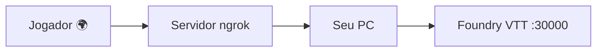

# 🎲 Foundry VTT Online com ngrok Guia Completo

> Hospedar o Foundry VTT para jogadores do mundo inteiro, sem pagar nada, sem abrir porta no roteador, sem IP fixo.

---

## 📋 O que você vai precisar

- Foundry VTT instalado e funcionando no seu PC
- Conta gratuita no [ngrok.com](https://ngrok.com)
- Windows com PowerShell
- ~15 minutos

---

## 🗺️ Como funciona



O ngrok cria um túnel seguro entre a internet e o seu PC. Ninguém acessa seu PC diretamente tudo passa pela rede do ngrok com HTTPS automático.

---

## FASE 1 Instalar e configurar o ngrok

### Passo 1 Criar conta

Acesse [dashboard.ngrok.com/signup](https://dashboard.ngrok.com/signup) e crie sua conta gratuita. Pode usar Google ou GitHub.

### Passo 2 Instalar o ngrok

Abra o **PowerShell como Administrador** e rode:

```powershell
winget install ngrok.ngrok
```

> [!tip] Sem winget?
> Baixe o instalador `.msi` direto em: <https://ngrok.com/download>

### Passo 3 Configurar o authtoken

No dashboard do ngrok, vá em **Getting Started → Your Authtoken** e copie o token. Depois cole no PowerShell:

```powershell
ngrok config add-authtoken SEU_TOKEN_AQUI
```

### Passo 4 Reivindicar seu domínio fixo gratuito

> [!important] Faça isso antes de continuar
> O domínio fixo é o que garante que a URL não muda entre sessões.

No dashboard do ngrok:

1. Menu lateral → **Domains** (dentro de **Cloud Edge**)
2. Clique em **+ Create Domain**
3. Seu domínio vai ser gerado automaticamente ex: `giraffe-welcomed-instantly.ngrok-free.app`
4. **Anote esse domínio** você vai usar em todos os passos seguintes

### Passo 5 Configurar o arquivo ngrok.yml

No PowerShell, rode:

```powershell
ngrok config edit
```

O arquivo vai abrir no editor padrão. Adicione o bloco do Foundry **sem apagar o authtoken**:

```yaml
version: "2"
authtoken: SEU_TOKEN_AQUI

tunnels:
  foundry:
    proto: http
    hostname: SEU-DOMINIO.ngrok-free.app
    addr: 127.0.0.1:30000
```

> [!warning] Atenção
> Substitua `SEU-DOMINIO.ngrok-free.app` pelo domínio que você criou no Passo 4. Não edite o `authtoken`.

Salve e feche o editor.

---

## FASE 2 Configurar o Foundry VTT

### Passo 6 Editar o options.json

O Foundry precisa saber que está rodando atrás de um proxy HTTPS. Abra o arquivo de configuração:

```powershell
notepad "$env:LOCALAPPDATA\FoundryVTT\Config\options.json"
```

Localize e altere apenas estas linhas:

```json
{
  "hostname": "SEU-DOMINIO.ngrok-free.app",
  "proxyPort": 443,
  "proxySSL": true,
  "upnp": false
}
```

> [!note] Não apague o resto do arquivo
> Apenas mude os valores dessas quatro chaves. Todo o restante permanece igual.

Salve e **feche o Foundry completamente** antes de continuar.

---

## FASE 3 Criar o comando `Iniciar-Aventura`

### Passo 7 Criar o script na sua pasta

Crie o arquivo `Iniciar-Aventura.ps1` em uma pasta de sua preferência (ex: `D:\scripts\`):

```powershell
# ============================================
# INICIAR-AVENTURA.PS1
# Abre Foundry VTT + ngrok automaticamente
# ============================================

$FoundryPath = "C:\Users\SEU_USUARIO\AppData\Local\FoundryVTT\FoundryVTT.exe"
$NgrokDomain = "https://SEU-DOMINIO.ngrok-free.app"

Write-Host ""
Write-Host "============================================" -ForegroundColor DarkMagenta
Write-Host "   FOUNDRY VTT + NGROK - Auto Launcher     " -ForegroundColor Magenta
Write-Host "============================================" -ForegroundColor DarkMagenta
Write-Host ""

Write-Host "[1/3] Iniciando Foundry VTT..." -ForegroundColor Cyan
if (Test-Path $FoundryPath) {
    Start-Process $FoundryPath
    Write-Host "      Foundry iniciado!" -ForegroundColor Green
} else {
    Write-Host "      AVISO: Foundry nao encontrado em:" -ForegroundColor Yellow
    Write-Host "      $FoundryPath" -ForegroundColor Yellow
    Write-Host "      Edite a variavel FoundryPath neste script." -ForegroundColor Yellow
}

Write-Host ""
Write-Host "[2/3] Aguardando Foundry subir na porta 30000..." -ForegroundColor Cyan
$tentativas = 0
while ($tentativas -lt 30) {
    Start-Sleep -Seconds 2
    $tentativas++
    try {
        $conn = New-Object System.Net.Sockets.TcpClient
        $conn.Connect("127.0.0.1", 30000)
        $conn.Close()
        Write-Host "      Foundry online!" -ForegroundColor Green
        break
    } catch {}
    Write-Host "      Aguardando... ($tentativas/30)" -ForegroundColor DarkGray
}

Write-Host ""
Write-Host "[3/3] Iniciando ngrok tunnel..." -ForegroundColor Cyan
Start-Process powershell -ArgumentList "-NoExit", "-Command", "ngrok start foundry"
Start-Sleep -Seconds 4

$NgrokDomain | Set-Clipboard

Write-Host ""
Write-Host "============================================" -ForegroundColor DarkGreen
Write-Host "   AVENTURA PRONTA! Manda pro grupo:"       -ForegroundColor Green
Write-Host ""
Write-Host "   $NgrokDomain"                            -ForegroundColor Yellow
Write-Host ""
Write-Host "   (link ja copiado pro clipboard!)"        -ForegroundColor DarkGray
Write-Host "============================================" -ForegroundColor DarkGreen
Write-Host ""
```

> [!warning] Substitua antes de salvar
>
> - `SEU_USUARIO` → seu nome de usuário do Windows
> - `SEU-DOMINIO.ngrok-free.app` → seu domínio ngrok do Passo 4

### Passo 8 Registrar o comando no PowerShell

Abra o perfil do PowerShell:

```powershell
notepad $PROFILE
```

Se perguntar para criar o arquivo, clique em **Sim**. Adicione no final:

```powershell
function Iniciar-Aventura {
    & "D:\scripts\Iniciar-Aventura.ps1" @args
}
```

> [!tip] Adapte o caminho
> Troque `D:\scripts\` pelo caminho onde você salvou o arquivo no Passo 7.

Salve e recarregue o perfil:

```powershell
. $PROFILE
```

---

## FASE 4 Testar tudo

### Passo 9 Primeiro teste

No PowerShell, digite:

```powershell
Iniciar-Aventura
```

Aguarde as três etapas concluírem. No final, o link já estará copiado no clipboard.

### Passo 10 Verificar se está online

Abra o link no navegador:

```
https://SEU-DOMINIO.ngrok-free.app
```

Se aparecer a tela de login do Foundry → **tudo funcionando!** ✅

> [!note] Aviso na primeira visita
> Na primeira vez que cada jogador acessar, o ngrok mostra uma tela de aviso. É só clicar em **Visit Site** para continuar. Isso acontece apenas uma vez por pessoa.

---

## 🌍 Jogadores internacionais

O ngrok funciona globalmente. Qualquer pessoa no mundo consegue conectar:

| País | Latência estimada |
|---|---|
| 🇧🇷 Brasil | ~7ms |
| 🇺🇸 EUA | ~150ms |
| 🇮🇹 Itália | ~200ms |
| 🏴󠁧󠁢󠁳󠁣󠁴󠁿 Escócia | ~200ms |
| 🇯🇵 Japão | ~280ms |
| 🇮🇪 Irlanda | ~200ms |

> [!tip] Latência em RPG de mesa
> 200-300ms é imperceptível em Foundry VTT. Não é FPS competitivo é texto, mapas e tokens.

---

## 🔁 Fluxo de cada sessão

A partir de agora, antes de cada sessão:

1. Abre o PowerShell
2. Digita `Iniciar-Aventura`
3. Aguarda as 3 etapas
4. Cola o link no Discord/WhatsApp do grupo
5. Joga 🎲

---

## ❓ Problemas comuns

> [!faq]- O launcher do Foundry mostra "Offline"
> É um falso negativo. O launcher não reconhece proxies ngrok. O servidor está online teste abrindo o link no navegador.

> [!faq]- O comando `Iniciar-Aventura` não é reconhecido
> Rode `. $PROFILE` no PowerShell para recarregar o perfil, ou feche e reabra o PowerShell.

> [!faq]- O Foundry não sobe (Passo 2 fica em loop)
> Verifique o caminho em `$FoundryPath` no script. Rode no PowerShell para encontrar o executável:
>
> ```powershell
> Get-ChildItem "$env:LOCALAPPDATA" -Recurse -Filter "FoundryVTT.exe" -ErrorAction SilentlyContinue | Select-Object FullName
> ```

> [!faq]- A URL mudou depois de reiniciar
> Verifique se o `hostname` no `ngrok.yml` está preenchido com seu domínio fixo (Passo 5). Se estiver vazio, o ngrok gera URL aleatória.

> [!faq]- Jogador recebe erro 429
> O plano gratuito tem limite de 200 requisições simultâneas. Para sessões normais de 3-6 jogadores isso nunca acontece. Se acontecer, reduza o tamanho dos assets (mapas, imagens) no Foundry.

---

## 📦 Resumo dos arquivos criados

| Arquivo | Localização | Função |
|---|---|---|
| `ngrok.yml` | `%LOCALAPPDATA%\ngrok\` | Config do túnel |
| `options.json` | `%LOCALAPPDATA%\FoundryVTT\Config\` | Config do Foundry |
| `Iniciar-Aventura.ps1` | Sua pasta de scripts | Script principal |
| `$PROFILE` | Auto | Registra o comando global |
