# Guia de Prompt: Pôster de Personagem Estilo Anime Moderno

Este documento serve como um guia detalhado para a criação de pôsteres de personagens de anime com uma estética moderna, inspirada em streetwear e design gráfico de alta qualidade. O objetivo é traduzir a essência de um personagem em uma ilustração visualmente impactante e com apelo cinematográfico.

## O Prompt Otimizado

Abaixo está uma versão refinada e direta do prompt, projetada para ser copiada e colada em geradores de imagem como o DALL-E. As seções entre chaves `{}` devem ser substituídas com as informações do personagem desejado.

```
Crie uma ilustração estilizada premium de {character_name} da franquia {franchise}, concebida como um pôster de streetwear moderno inspirado em animes. A arte deve ter uma identidade visual forte e uma composição cinematográfica.

**Estilo Visual:**
- Estética de ilustração de anime com design de moda streetwear/techwear.
- Composição de pôster gráfico de alta qualidade.
- Linhas ultra-limpas, renderização semi-plana com detalhes seletivos.
- Alto contraste, formas bem definidas e uma sensação editorial elegante.

**Personagem e Pose:**
- A pose deve ser icônica e expressar a personalidade canônica do personagem (ex: movimento explosivo para heróis, postura calma para estrategistas).
- A expressão facial deve corresponder ao temperamento do personagem (confiante, frio, brincalhão, ameaçador).
- Reinterprete o traje original como moda contemporânea, mantendo traços de identidade reconhecíveis (símbolos, silhuetas, acessórios).

**Composição e Cor:**
- Composição vertical em {aspect_ratio}.
- Enquadramento descentralizado com forte movimento diagonal.
- Fundo branco ou quase branco dominante.
- Use a cor de assinatura mais reconhecível do personagem como o principal destaque visual, complementada por uma cor secundária.
- O fundo deve ser abstrato e gráfico, com formas geométricas e elementos que apoiem o personagem sem sobrecarregar a cena.

**Efeitos e Finalização:**
- Adicione efeitos visuais estilizados que reflitam a energia do personagem (rastros de movimento, brilhos, linhas de impacto).
- Iluminação cinematográfica direcional com sombras nítidas e destaques de borda.
- Acabamento ultra-limpo, semelhante a um vetor, com qualidade de pôster 4K.
```

### Como Usar

1. **`{character_name}`**: Substitua pelo nome do personagem que você deseja ilustrar.
2. **`{franchise}`**: Substitua pela série, jogo ou mídia de onde o personagem se origina.
3. **`{aspect_ratio}`**: Defina a proporção da imagem, como `9:16` para um formato de story ou `2:3` para um pôster padrão.

## Galeria de Referências de Personagens

Abaixo estão alguns exemplos de personagens com estilos e identidades visuais distintas que podem ser usados como inspiração para suas criações. As imagens servem como referência para a diversidade de designs que podem ser adaptados pelo prompt.

| Personagem | Imagem |
| :--- | :---: |
| Akeno Himejima | 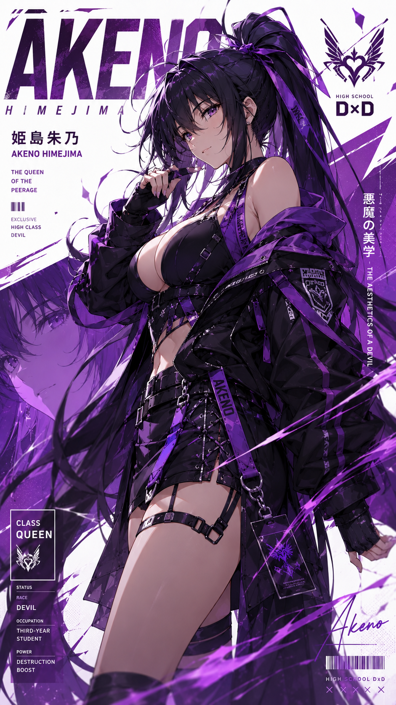 |
| Arthur Leywin | 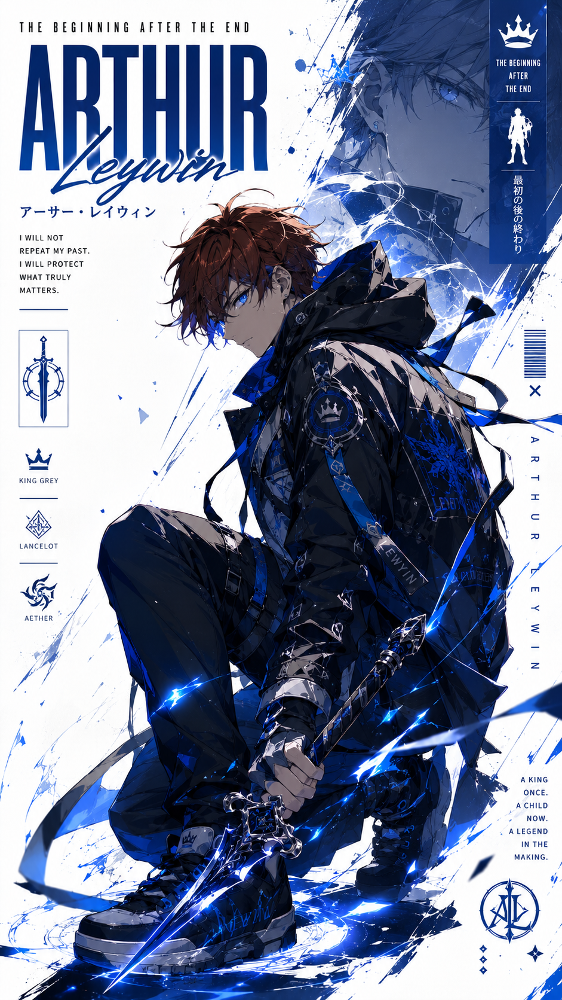 |
| Jinx | 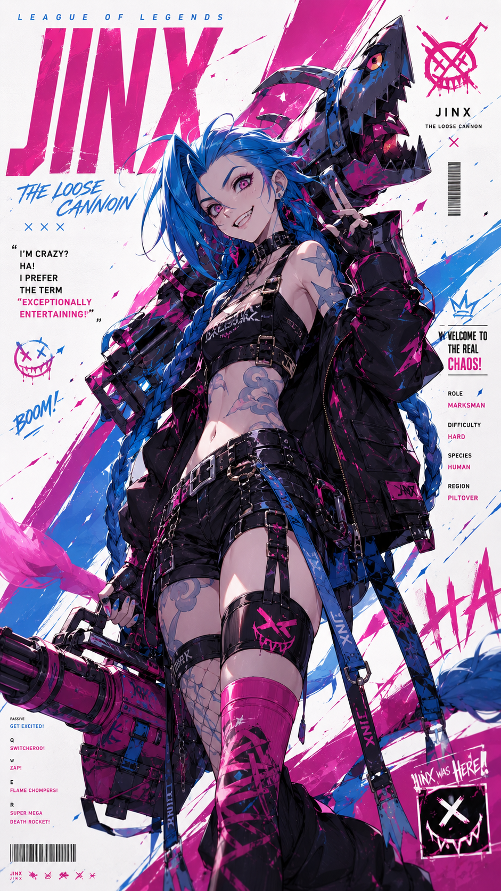 |
| Jin-Woo | 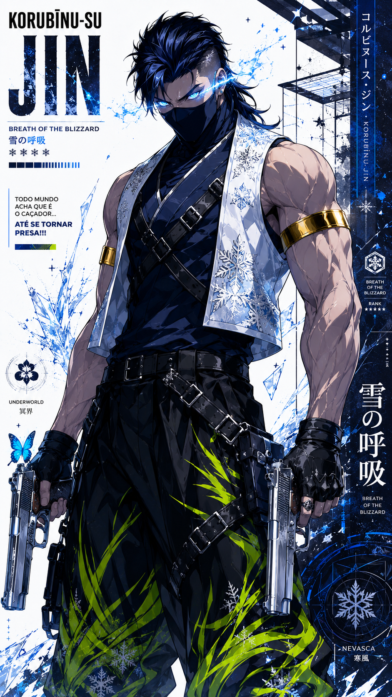 |
| Mako | 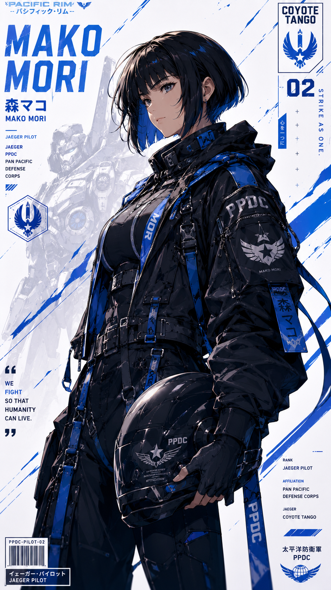 |
| Rias Gremory | 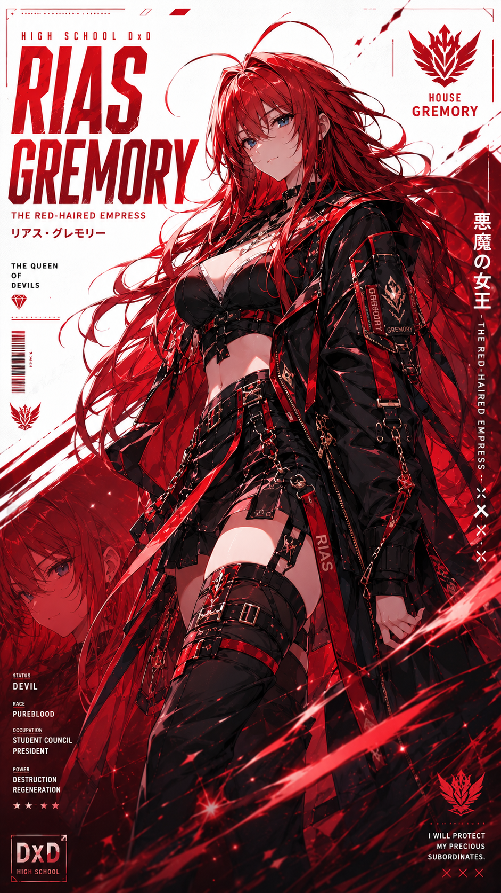 |
| Saga de Gêmeos | 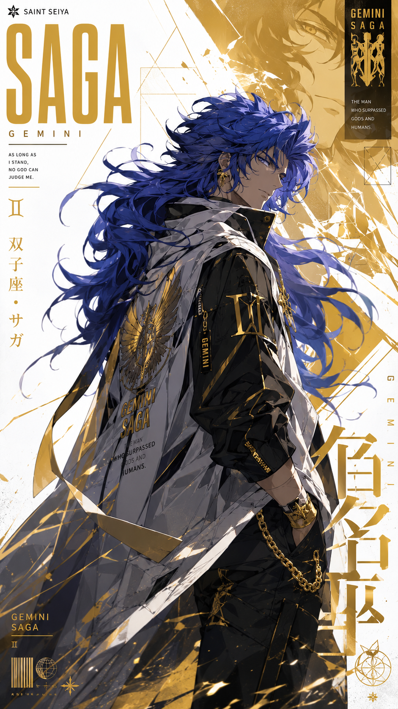 |
| Sanemi Shinazugawa | 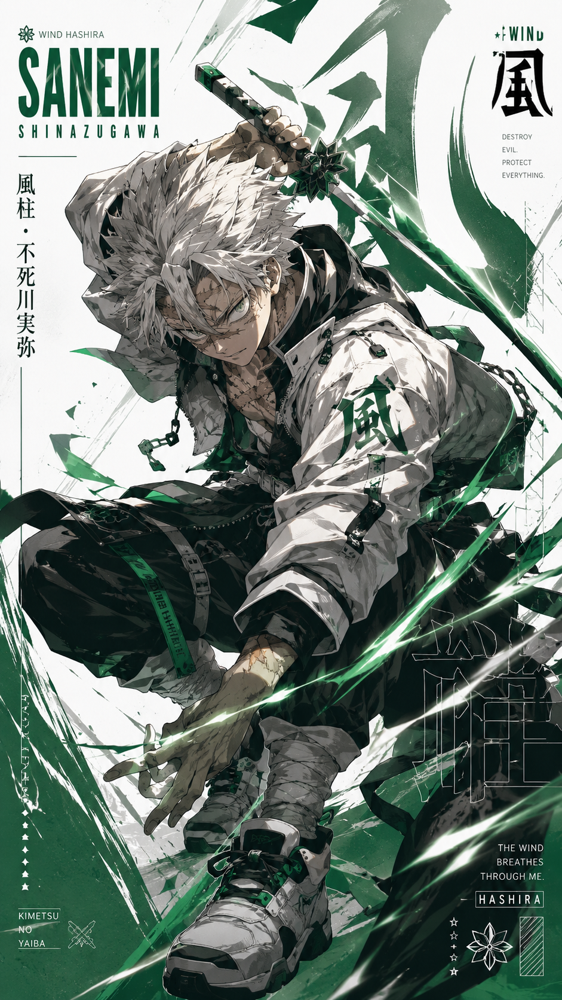 |
| Selene | 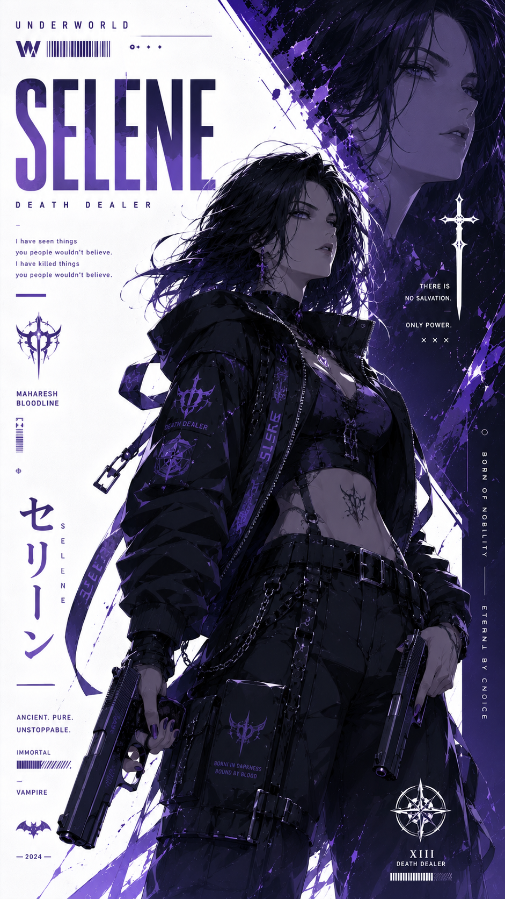 |
| Tang Rou | 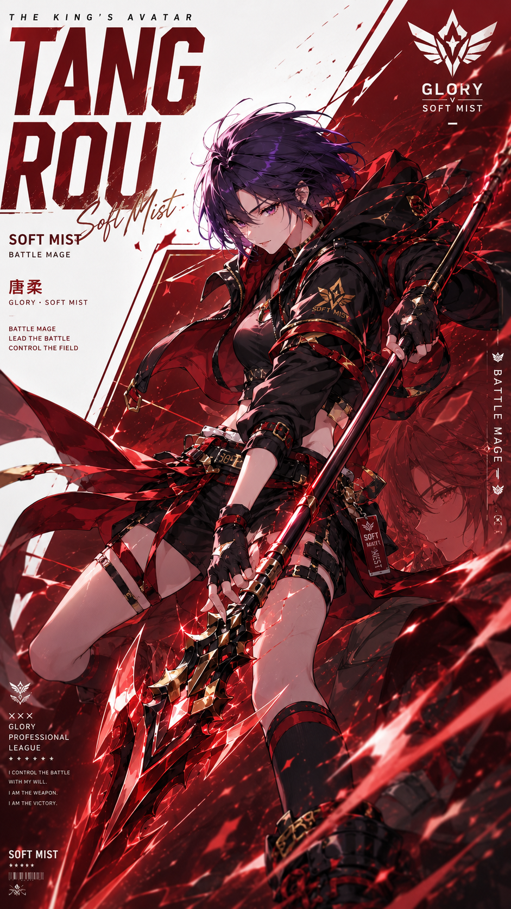 |
| Xenovia Quarta | 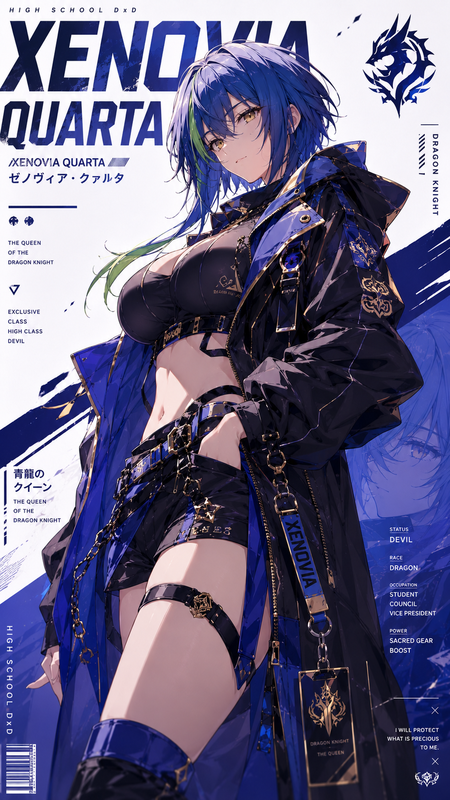 |
