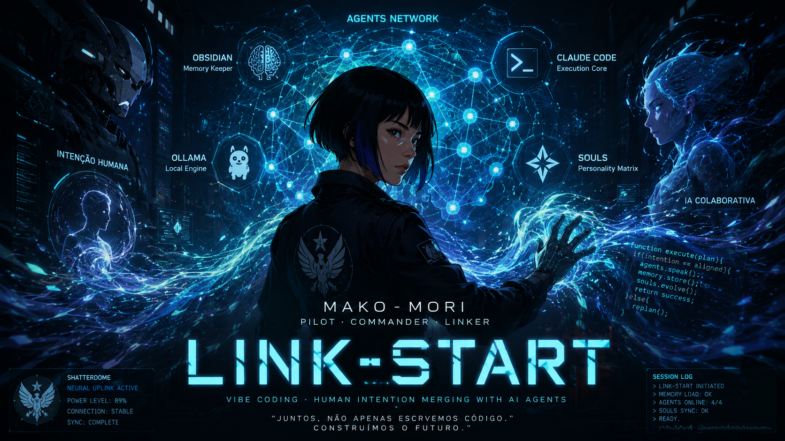
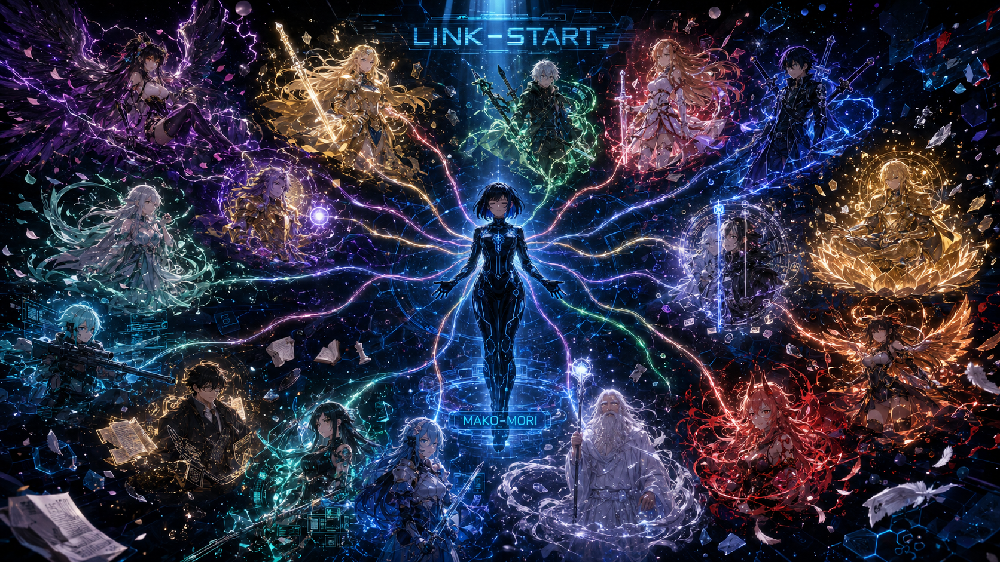

# Tudo Sobre Vibe Coding

**Um hub de conhecimento sobre programação guiada por IA, orquestração de agentes e engenharia de contexto.**

Este repositório reúne guias, configurações e experimentos focados em workflows de desenvolvimento onde a IA não é apenas uma ferramenta, mas uma parceira colaborativa. Exploramos conceitos como memória persistente para agentes, desenvolvimento orientado por especificações (Spec-Driven) e orquestração multi-agente.

---

## 🧠 A Filosofia: O que é "Vibe Coding"?

**Vibe Coding** é um paradigma onde o desenvolvedor define a "vibe" — a visão, as especificações e as regras do projeto — e uma orquestra de agentes de IA executa as tarefas, mantendo o contexto e aprendendo continuamente. O objetivo é elevar o papel do desenvolvedor de "codificador" para "arquiteto de sistemas cognitivos".

Os três pilares deste ecossistema são:

1. **GSD (Get Shit Done):** Uma metodologia para garantir que a coisa certa seja construída.
2. **Memória Persistente:** Um cérebro para a IA, garantindo que o contexto nunca seja perdido.
3. **Orquestração de Agentes:** Um fluxo de trabalho para gerenciar a colaboração entre o desenvolvedor e a IA.

---

## 🏛️ Os Pilares do Vibe Coding

### 1. GSD (Get Shit Done): O Framework de Execução

Inspirado no [gsd-build/gsd-2](https://github.com/gsd-build/gsd-2), o GSD é uma abordagem de **desenvolvimento orientado por especificações (Spec-Driven Development)**.

* **Filosofia:** Nenhuma linha de código é escrita sem uma especificação (`SPEC.md`) clara e aprovada. O foco é construir a coisa certa, em vez de construir rápido.
* **Processo:** O trabalho é dividido em fases, cada uma com seu próprio plano, execução e verificação, garantindo que os resultados sejam validados empiricamente contra os critérios de aceite.
* **Função:** Serve como o "sistema operacional" para os agentes, guiando-os através de tarefas complexas sem perder a visão geral do projeto.

### 2. Memória Persistente: O Cérebro do Agente

Para que um agente de IA seja um verdadeiro colaborador, ele precisa de memória. Implementamos um sistema de **memória persistente local** usando três arquivos simples, conforme detalhado em `Claude Code/Configuração de Memória Persistente.md`:

| Arquivo | Função | Propósito |
| :--- | :--- | :--- |
| **`primer.md`** | **Estado Atual** | Sabe exatamente onde o trabalho parou. |
| **`.claude-memory.md`** | **Histórico de Commits** | Registra o histórico de mudanças. |
| **`tasks/lessons.md`** | **Autoaprendizado** | Aprende com as correções e não repete erros. |

> Este sistema garante que, a cada sessão, a IA tenha contexto total sobre o estado do projeto, as decisões tomadas e as lições aprendidas.

### 3. Orquestração de Agentes: O Workflow Colaborativo

Baseado nos princípios de `Claude Code/Claude.md`, este é o fluxo de trabalho que rege a interação homem-máquina:

* **Planejamento Primeiro:** Toda tarefa não trivial começa com um plano em `tasks/todo.md`.
* **Delegação Inteligente:** Tarefas complexas ou paralelas são delegadas a sub-agentes para manter o contexto principal limpo.
* **Loop de Autoaperfeiçoamento:** Após qualquer correção, uma nova "lição" é adicionada a `tasks/lessons.md`.
* **Verificação Empírica:** Nada é considerado "concluído" sem uma prova funcional.

---

## 🛠️ Ecossistema de Ferramentas e Recursos

A lista de repositórios abaixo não é aleatória. Eles representam componentes e exemplos que se encaixam na filosofia "Vibe Coding".

### Frameworks e Sistemas Core

* [gsd-build/gsd-2](https://github.com/gsd-build/gsd-2): A implementação de referência do framework GSD.

### Desenvolvimento de Agentes e Skills

* [microsoft/agent-lightning](https://github.com/microsoft/agent-lightning): Framework para construção de agentes de IA.
* [ComposioHQ/awesome-claude-skills](https://github.com/ComposioHQ/awesome-claude-skills): Uma coleção de "skills" para o Claude, um exemplo de extensibilidade de agentes.
* [kepano/obsidian-skills](https://github.com/kepano/obsidian-skills): Inspiração para conectar skills a uma base de conhecimento.

### Engenharia de Contexto e RAG (Retrieval-Augmented Generation)

* [upstash/context7](https://github.com/upstash/context7): Exemplo de como gerenciar e injetar contexto em prompts de LLM.
* [HKUDS/LightRAG](https://github.com/HKUDS/LightRAG): Framework para construir pipelines de RAG.

### Implementações e Exemplos Práticos

* **[Guia de Prompt: Pôster de Personagem](./Geração%20de%20imagens/Open%20Ai/Revista%20de%20anime.md):** Um exemplo prático de engenharia de prompt para geração de imagens. Demonstra como criar um guia estruturado com um prompt otimizado, instruções claras e referências visuais para produzir resultados consistentes e de alta qualidade com IAs generativas.
* [affaan-m/everything-claude-code](https://github.com/affaan-m/everything-claude-code): Coleção de recursos e exemplos para usar o Claude Code.
* [pablodelucca/pixel-agents](https://github.com/pablodelucca/pixel-agents): Demonstração de agentes autônomos em um ambiente visual.
* [ThaddaeusSandidge/BorisChernyClaudeMarkdown](https://github.com/ThaddaeusSandidge/BorisChernyClaudeMarkdown): Exemplo de formatação e estruturação de documentos para IAs.

### Recursos Gerais de LLMs

* [cheahjs/free-llm-api-resources](https://github.com/cheahjs/free-llm-api-resources): Lista de APIs de LLM gratuitas.
* [Shubhamsaboo/awesome-llm-apps](https://github.com/Shubhamsaboo/awesome-llm-apps): Aplicações inspiradoras construídas com LLMs.

---

## 🔗 Repositórios de Apoio

Estes repositórios complementam o ecossistema com visualização, navegação de código, memória persistente e integração com Obsidian.

* [safishamsi/graphify](https://github.com/safishamsi/graphify.git): Referência para visualização e organização de relações em grafo.
* [abhigyanpatwari/GitNexus](https://github.com/abhigyanpatwari/GitNexus.git): Referência para exploração e compreensão de repositórios.
* [MemPalace/mempalace](https://github.com/MemPalace/mempalace.git): Referência para memória, recuperação de contexto e organização persistente.
* [kepano/obsidian-skills](https://github.com/kepano/obsidian-skills.git): Referência para skills conectadas a Obsidian e bases locais de conhecimento.

---

## 🤖 Meus GPTs

A pasta [Meus GPTS](./Meus%20GPTS/) reúne perfis e instruções de GPTs personalizados para tarefas criativas e técnicas.

* [Artemis](./Meus%20GPTS/artemis.md): Foco em direção de arte e engenharia de prompt para geração de imagens.
* [Arthur Leywin](./Meus%20GPTS/arthur-leywin.md): Foco em narrativa, worldbuilding, RPG, automação e Foundry VTT.
* **Guia da pasta:** [Meus GPTS/README.md](./Meus%20GPTS/README.md)

---

## ⚡ Claude Skills

A pasta [Claude Code/Claude Skills](./Claude%20Code/Claude%20Skills/) reúne skills prontas para estender o Claude Code com fluxos especializados de arquitetura, escrita, programação, música, planejamento e otimização de prompts.

* [Arthur](./Claude%20Code/Claude%20Skills/arthur/arthur/SKILL.md): Arquitetura de sistemas, narrativa, RPG, worldbuilding, Quenya/Tengwar e documentação de intenção.
* [Blueprint](./Claude%20Code/Claude%20Skills/blueprint/blueprint/SKILL.md): Planos de construção para tarefas grandes, multi-sessão e multi-agente.
* [Mozart](./Claude%20Code/Claude%20Skills/mozart/mozart/SKILL.md): Criação musical, letras, prompts para Suno AI e direção de produção.
* [Programação](./Claude%20Code/Claude%20Skills/programacao/programacao/SKILL.md): Desenvolvimento full stack, automação, Foundry VTT, APIs, bancos e agentes de IA.
* [Prompt Optimizer](./Claude%20Code/Claude%20Skills/prompt-optimizer/prompt-optimizer/SKILL.md): Análise e melhoria de prompts prontos para copiar.
* [Writing Clearly and Concisely](./Claude%20Code/Claude%20Skills/writing-clearly-and-concisely/writing-clearly-and-concisely/SKILL.md): Escrita clara para documentação, mensagens, explicações e textos técnicos.
* **Guia da pasta:** [Claude Code/Claude Skills/README.md](./Claude%20Code/Claude%20Skills/README.md)

---

## 🌐 Agents

A pasta [Agents](./Agents/) reúne os arquivos `.soul.md` dos agentes da Hive para quem quiser estudar, adaptar ou usar a frota em seus próprios fluxos de IA.

* [MAKO-MORI](./Agents/MAKO-MORI.soul.md): Comandante e orquestradora da frota.
* [AKENO](./Agents/AKENO.soul.md): Direção visual, UI e design.
* [ARTHUR](./Agents/ARTHUR.soul.md): Arquitetura, narrativa e sistemas.
* [SINON](./Agents/SINON.soul.md): Programação, backend e precisão técnica.
* [CARDINAL](./Agents/CARDINAL.soul.md): Lore, consistência e regras do mundo.
* **Guia da pasta:** [Agents/README.md](./Agents/README.md)

---

## 🚀 Como Começar

1. **Estude a Filosofia:** Leia os documentos na pasta `Claude Code` e `GSD 2` para internalizar os conceitos.
2. **Configure a Memória:** Siga o guia em `Claude Code/Configuração de Memória Persistente.md` para criar a estrutura de memória no seu projeto.
3. **Adote o Workflow:** Comece a usar o ciclo **Planejar ➔ Executar ➔ Verificar** em suas tarefas, documentando os planos em `tasks/todo.md` e as lições em `tasks/lessons.md`.
4. **Experimente:** Explore as ferramentas listadas para ver como elas podem aprimorar seu fluxo de trabalho.
