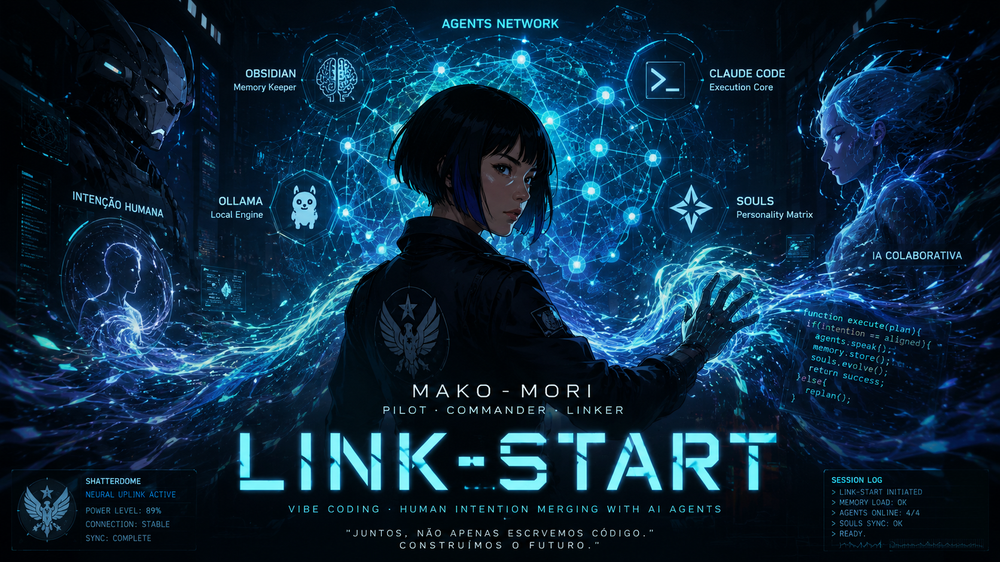
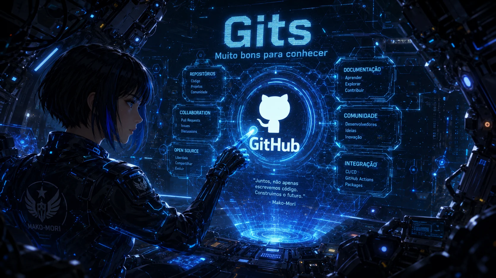
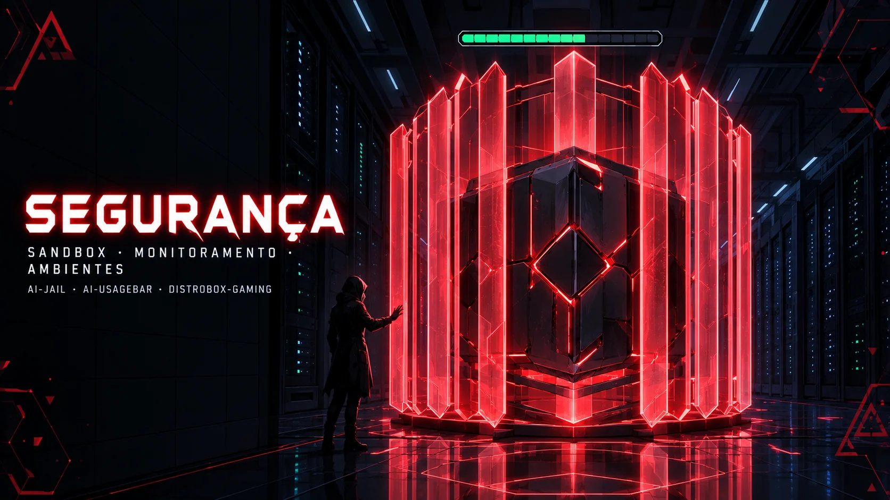
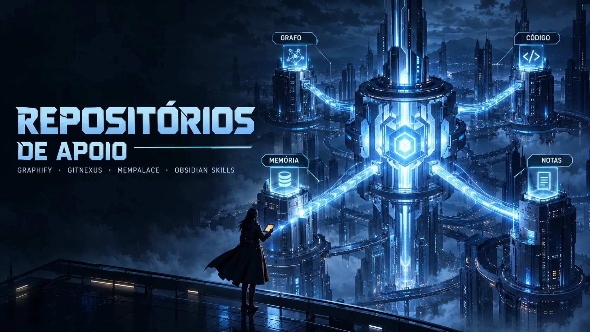
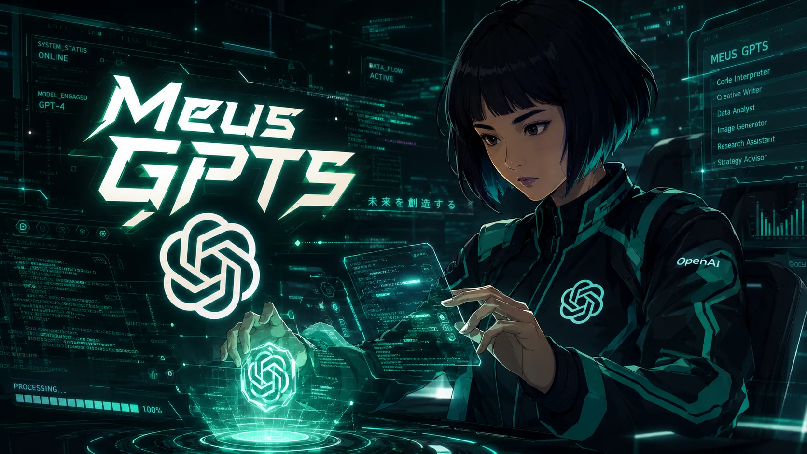
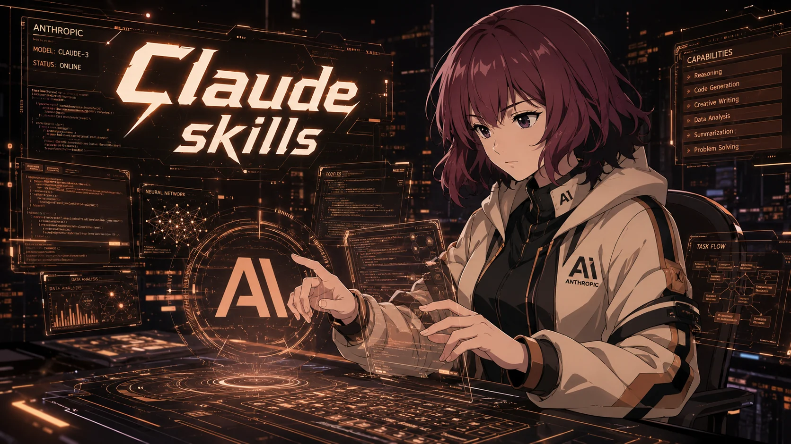
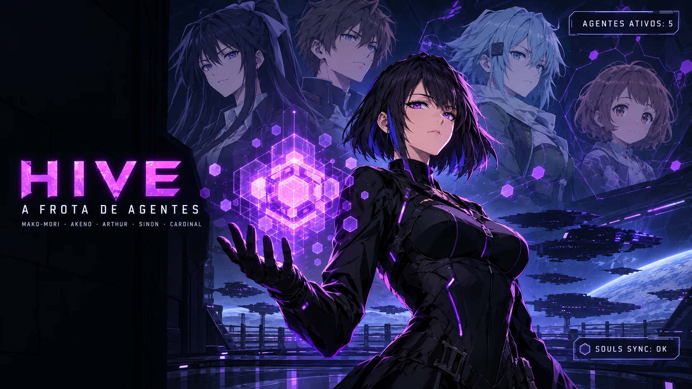
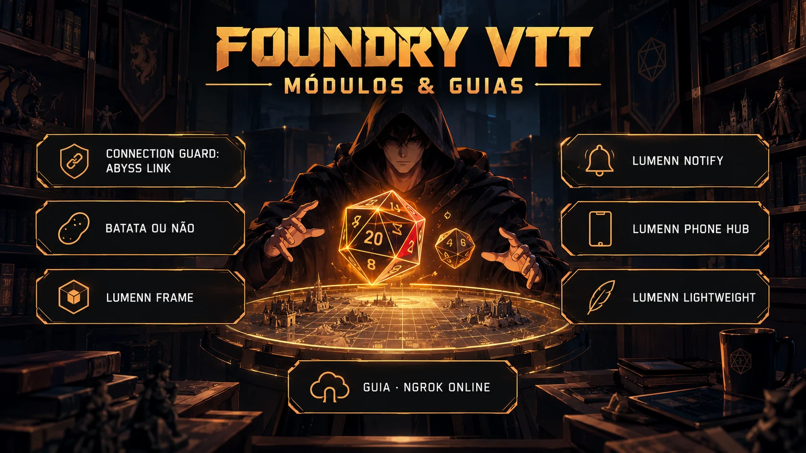
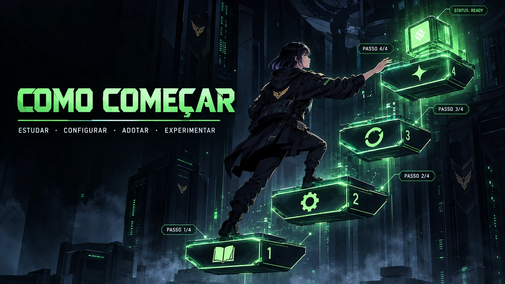

# Tudo Sobre Vibe Coding

**Um hub de conhecimento sobre programação guiada por IA, orquestração de agentes e engenharia de contexto.**

Este repositório reúne guias, configurações e experimentos focados em workflows de desenvolvimento onde a IA não é apenas uma ferramenta, mas uma parceira colaborativa. Exploramos conceitos como memória persistente para agentes, desenvolvimento orientado por especificações (Spec-Driven) e orquestração multi-agente.

**Nesta página:**

- [🧠 A Filosofia: O que é "Vibe Coding"?](#a-filosofia-o-que-é-vibe-coding)
- [🏛️ Os Pilares do Vibe Coding](#os-pilares-do-vibe-coding)
  - [1. GSD (Get Shit Done)](#1-gsd-get-shit-done-o-framework-de-execução)
  - [2. Memória Persistente](#2-memória-persistente-o-cérebro-do-agente)
  - [3. Orquestração de Agentes](#3-orquestração-de-agentes-o-workflow-colaborativo)
- [🛠️ Ecossistema de Ferramentas e Recursos](#ecossistema-de-ferramentas-e-recursos)
- [🔗 Repositórios de Apoio](#repositórios-de-apoio)
- [🤖 Meus GPTs](#meus-gpts)
- [⚡ Claude Skills](#claude-skills)
- [🌐 Agents](#agents)
- [🎲 Foundry VTT](#foundry-vtt)
- [🚀 Como Começar](#como-começar)

---

## 🧠 A Filosofia: O que é "Vibe Coding"?

> **Vibe Coding** é um paradigma onde o desenvolvedor define a "vibe" — a visão, as especificações e as regras do projeto — e uma orquestra de agentes de IA executa as tarefas, mantendo o contexto e aprendendo continuamente. O objetivo é elevar o papel do desenvolvedor de "codificador" para **arquiteto de sistemas cognitivos**.

Os três pilares deste ecossistema são:

| Pilar | O que garante |
| :--- | :--- |
| **GSD (Get Shit Done)** | Que a coisa certa seja construída. |
| **Memória Persistente** | Que o contexto nunca seja perdido. |
| **Orquestração de Agentes** | Que a colaboração humano-IA tenha um fluxo claro. |

---

## 🏛️ Os Pilares do Vibe Coding

### 1. GSD (Get Shit Done): O Framework de Execução

Inspirado no [gsd-build/gsd-2](https://github.com/gsd-build/gsd-2), o GSD é uma abordagem de **desenvolvimento orientado por especificações (Spec-Driven Development)**.

* **Filosofia:** Nenhuma linha de código é escrita sem uma especificação (`SPEC.md`) clara e aprovada. O foco é construir a coisa certa, em vez de construir rápido.
* **Processo:** O trabalho é dividido em fases, cada uma com seu próprio plano, execução e verificação, garantindo que os resultados sejam validados empiricamente contra os critérios de aceite.
* **Função:** Serve como o "sistema operacional" para os agentes, guiando-os através de tarefas complexas sem perder a visão geral do projeto.

### 2. Memória Persistente: O Cérebro do Agente

Para que um agente de IA seja um verdadeiro colaborador, ele precisa de memória. Implementamos um sistema de **memória persistente local** usando três arquivos simples, conforme detalhado em `Claude Code/Configuração de Memória Persistente.md`:

| Arquivo | Função | Propósito |
| :--- | :--- | :--- |
| **`primer.md`** | **Estado Atual** | Sabe exatamente onde o trabalho parou. |
| **`.claude-memory.md`** | **Histórico de Commits** | Registra o histórico de mudanças. |
| **`tasks/lessons.md`** | **Autoaprendizado** | Aprende com as correções e não repete erros. |

> Este sistema garante que, a cada sessão, a IA tenha contexto total sobre o estado do projeto, as decisões tomadas e as lições aprendidas.

### 3. Orquestração de Agentes: O Workflow Colaborativo

Baseado nos princípios de `Claude Code/Claude.md`, este é o fluxo de trabalho que rege a interação homem-máquina:

* **Planejamento Primeiro:** Toda tarefa não trivial começa com um plano em `tasks/todo.md`.
* **Delegação Inteligente:** Tarefas complexas ou paralelas são delegadas a sub-agentes para manter o contexto principal limpo.
* **Loop de Autoaperfeiçoamento:** Após qualquer correção, uma nova "lição" é adicionada a `tasks/lessons.md`.
* **Verificação Empírica:** Nada é considerado "concluído" sem uma prova funcional.

---

## 🛠️ Ecossistema de Ferramentas e Recursos

A lista de repositórios abaixo não é aleatória. Eles representam componentes e exemplos que se encaixam na filosofia "Vibe Coding".

### Frameworks e Sistemas Core

* [gsd-build/gsd-2](https://github.com/gsd-build/gsd-2): A implementação de referência do framework GSD.

### Desenvolvimento de Agentes e Skills

| Repositório | O quê |
| :--- | :--- |
| [microsoft/agent-lightning](https://github.com/microsoft/agent-lightning) | Framework para construção de agentes de IA. |
| [ComposioHQ/awesome-claude-skills](https://github.com/ComposioHQ/awesome-claude-skills) | Coleção de "skills" para o Claude — extensibilidade de agentes. |
| [kepano/obsidian-skills](https://github.com/kepano/obsidian-skills) | Inspiração para conectar skills a uma base de conhecimento. |
| [uphiago/recon-skills](https://github.com/uphiago/recon-skills) | Skills de recon e pentest: CORS, XSS, SQLi, SSRF, RCE, WordPress, MCP, cloud. Testado em campo, MIT. |

### Engenharia de Contexto e RAG (Retrieval-Augmented Generation)

| Repositório | O quê |
| :--- | :--- |
| [upstash/context7](https://github.com/upstash/context7) | Documentação de código atualizada e específica de versão, injetada direto nos prompts de LLMs. |
| [HKUDS/LightRAG](https://github.com/HKUDS/LightRAG) | Framework para construir pipelines de RAG. |
| [akitaonrails/ai-memory](https://github.com/akitaonrails/ai-memory) | Memória de longo prazo para CLIs de agente, com handoff entre fornecedores de IA (Rust). |

### Implementações e Exemplos Práticos

* **[Guia de Prompt: Pôster de Personagem](./Geração%20de%20imagens/Open%20Ai/Revista%20de%20anime.md):** engenharia de prompt para geração de imagens — guia estruturado com prompt otimizado, instruções claras e referências visuais para resultados consistentes.
* [affaan-m/everything-claude-code](https://github.com/affaan-m/everything-claude-code): Coleção de recursos e exemplos para usar o Claude Code.
* [pablodelucca/pixel-agents](https://github.com/pablodelucca/pixel-agents): Demonstração de agentes autônomos em um ambiente visual.
* [ThaddaeusSandidge/BorisChernyClaudeMarkdown](https://github.com/ThaddaeusSandidge/BorisChernyClaudeMarkdown): Template `CLAUDE.md` com Agentic Context Engineering (ACE).

### Recursos Gerais de LLMs

| Repositório | O quê |
| :--- | :--- |
| [jtig37/free-llm-api-resources](https://github.com/jtig37/free-llm-api-resources) | Lista de APIs de LLM gratuitas (sucessora do antigo `cheahjs/free-llm-api-resources`, que saiu do ar). |
| [Shubhamsaboo/awesome-llm-apps](https://github.com/Shubhamsaboo/awesome-llm-apps) | 100+ agentes, skills e apps de RAG — open source. |
| [akitaonrails/llm-coding-benchmark](https://github.com/akitaonrails/llm-coding-benchmark) | Benchmark dos LLMs de código mais populares, com automação via OpenCode (Python). |

### Segurança, Monitoramento e Ambientes

| Repositório | O quê |
| :--- | :--- |
| [akitaonrails/ai-jail](https://github.com/akitaonrails/ai-jail) | Sandbox multiplataforma para rodar agentes de IA com restrições mais firmes (Rust). |
| [akitaonrails/ai-usagebar](https://github.com/akitaonrails/ai-usagebar) | Widget waybar (Rust) para monitorar créditos e planos de Claude, GPT, GLM e OpenRouter. |
| [akitaonrails/distrobox-gaming](https://github.com/akitaonrails/distrobox-gaming) | Script de Distrobox focada em gaming, com emuladores pré-configurados (Shell). |

---

## 🔗 Repositórios de Apoio

Estes repositórios complementam o ecossistema com visualização, navegação de código, memória persistente e integração com Obsidian.

| Repositório | O quê |
| :--- | :--- |
| [safishamsi/graphify](https://github.com/safishamsi/graphify) | Qualquer codebase vira um grafo de conhecimento consultável — skill para Claude Code, Cursor, Codex e Gemini CLI. |
| [abhigyanpatwari/GitNexus](https://github.com/abhigyanpatwari/GitNexus) | Motor de inteligência de código local, sem servidor. |
| [MemPalace/mempalace](https://github.com/MemPalace/mempalace) | Sistema de memória para IA, com rankings e recuperação de contexto. |
| [kepano/obsidian-skills](https://github.com/kepano/obsidian-skills) | Skills de agente para Obsidian (Markdown, Bases, JSON Canvas). |

---

## 🤖 Meus GPTs

A pasta [Meus GPTS](./Meus%20GPTS/) reúne perfis e instruções de GPTs personalizados para tarefas criativas e técnicas.

* [ÁRTEMIS](./Meus%20GPTS/%C3%81RTEMIS.md): Prompt architect e companion visual — direção de arte e engenharia de prompt para geração de imagens.
* [ARTHUR LEYWIN](./Meus%20GPTS/ARTHUR.md): King of Architecture — narrativa, worldbuilding, RPG, automação e Foundry VTT.
* [MAKO-MORI](./Meus%20GPTS/MAKO-MORI.md): Comandante da frota Fluctlight — comando e orquestração de agentes.
* [POWER](./Meus%20GPTS/POWER.md): Creative Entity Supreme — música, roteiro, VFX e produção audiovisual.
* **Guia da pasta:** [Meus GPTS/README.md](./Meus%20GPTS/README.md)

---

## ⚡ Claude Skills

A pasta [Claude Code/Claude Skills](./Claude%20Code/Claude%20Skills/) reúne skills prontas para estender o Claude Code com fluxos especializados de arquitetura, escrita, programação, música, planejamento e otimização de prompts.

| Skill | Foco |
| :--- | :--- |
| [Arthur](./Claude%20Code/Claude%20Skills/arthur/arthur/SKILL.md) | Arquitetura de sistemas, narrativa, RPG, worldbuilding, Quenya/Tengwar e documentação de intenção. |
| [Blueprint](./Claude%20Code/Claude%20Skills/blueprint/blueprint/SKILL.md) | Planos de construção para tarefas grandes, multi-sessão e multi-agente. |
| [Mozart](./Claude%20Code/Claude%20Skills/mozart/mozart/SKILL.md) | Criação musical, letras, prompts para Suno AI e direção de produção. |
| [Programação](./Claude%20Code/Claude%20Skills/programacao/programacao/SKILL.md) | Full stack, automação, Foundry VTT, APIs, bancos e agentes de IA. |
| [Prompt Optimizer](./Claude%20Code/Claude%20Skills/prompt-optimizer/prompt-optimizer/SKILL.md) | Análise e melhoria de prompts, prontos para copiar. |
| [Writing Clearly and Concisely](./Claude%20Code/Claude%20Skills/writing-clearly-and-concisely/writing-clearly-and-concisely/SKILL.md) | Escrita clara para documentação, mensagens e textos técnicos. |

**Guia da pasta:** [Claude Code/Claude Skills/README.md](./Claude%20Code/Claude%20Skills/README.md)

---

## 🌐 Agents

A pasta [Agents](./Agents/) reúne os arquivos `.soul.md` dos agentes da Hive para quem quiser estudar, adaptar ou usar a frota em seus próprios fluxos de IA.

| Agente | Função |
| :--- | :--- |
| [MAKO-MORI](./Agents/MAKO-MORI.soul.md) | Comandante e orquestradora da frota. |
| [AKENO](./Agents/AKENO.soul.md) | Direção visual, UI e design. |
| [ARTHUR](./Agents/ARTHUR.soul.md) | Arquitetura, narrativa e sistemas. |
| [SINON](./Agents/SINON.soul.md) | Programação, backend e precisão técnica. |
| [CARDINAL](./Agents/CARDINAL.soul.md) | Lore, consistência e regras do mundo. |

**Guia da pasta:** [Agents/README.md](./Agents/README.md)

---

## 🎲 Foundry VTT

* **[Guia: Hospedar Foundry VTT Online com ngrok](./Foundry/Como%20instalar%20o%20ngrok.md):** expor o Foundry VTT pela internet — sem abrir portas, sem IP fixo, 100% gratuito.

### Módulos próprios

Módulos desenvolvidos para Foundry VTT, mantidos no GitHub [SoftMissT](https://github.com/SoftMissT):

| Módulo | O quê |
| :--- | :--- |
| [Connection Guard: Abyss Link](https://github.com/SoftMissT/foundry-vtt-connection-guard) | Monitora latência, detecta degradação preditiva, reconecta automaticamente e configura a rota de conexão escolhida pelo mestre. |
| [Batata Ou Não](https://github.com/SoftMissT/FoundryVTT-BatataOuN-o-V2) | Detecta se o computador do jogador é uma batata e configura os gráficos automaticamente. |
| [Lumenn Frame](https://github.com/SoftMissT/Lumenn-Frame) | Editor de grafo cinemático: cenas, áudio e notas com fluxo narrativo direcional. |
| [Lumenn Notify](https://github.com/SoftMissT/lumenn-notify) | Mensagens narrativas, perfis e canais (Sistema e Constelações) para Foundry v14+. |
| [Lumenn Phone Hub](https://github.com/SoftMissT/Lumenn-phone-hub) | Celular diegético: mensagens, redes sociais, banco e notícias — independente de sistema (v13–v14). |
| [Lumenn Lightweight](https://github.com/SoftMissT/lumenn-lightweight) | Otimiza imagens para WebP com modo lote e hook de upload automático. |
| [Lumenn Roll Relay](https://github.com/SoftMissT/lumenn-roll-relay) | Retransmite rolagens para o Discord, com leaderboard. |
| [Night Assassins CSB Automation](https://github.com/SoftMissT/night-assassins-csb-automation) | Automação de rolagens, dano, atributos e Habilidades Especiais para Foundry + Custom System Builder. |
| [Night Assassins System](https://github.com/SoftMissT/night-assassins-system) | Sistema completo para Foundry v14: fichas, progressão, combate e Respirações com DataModels próprios. |

---

## 🚀 Como Começar

1. **Estude a Filosofia:** Leia os documentos na pasta `Claude Code` e `GSD 2` para internalizar os conceitos.
2. **Configure a Memória:** Siga o guia em `Claude Code/Configuração de Memória Persistente.md` para criar a estrutura de memória no seu projeto.
3. **Adote o Workflow:** Comece a usar o ciclo **Planejar ➔ Executar ➔ Verificar** em suas tarefas, documentando os planos em `tasks/todo.md` e as lições em `tasks/lessons.md`.
4. **Experimente:** Explore as ferramentas listadas para ver como elas podem aprimorar seu fluxo de trabalho.
